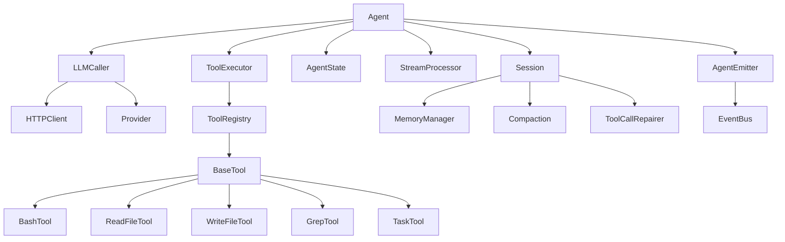

# Coding-Agent 优化建议文档

> 深度分析当前 Agent 核心逻辑，列出可优化点和新增功能建议

**文档版本**: v1.0  
**分析日期**: 2026-02-26  
**分析范围**: `src/agent-v2/` 核心模块

---

## 目录

1. [执行摘要](#执行摘要)
2. [核心架构分析](#核心架构分析)
3. [核心执行逻辑优化](#核心执行逻辑优化)
4. [工具系统优化](#工具系统优化)
5. [会话管理优化](#会话管理优化)
6. [错误处理优化](#错误处理优化)
7. [流式处理优化](#流式处理优化)
8. [Provider 层优化](#provider 层优化)
9. [记忆系统优化](#记忆系统优化)
10. [可观测性优化](#可观测性优化)
11. [用户体验优化](#用户体验优化)
12. [架构扩展性优化](#架构扩展性优化)
13. [安全性优化](#安全性优化)
14. [实施路线图](#实施路线图)

---

## 执行摘要

### 当前架构优势

| 优势 | 说明 |
|------|------|
| **模块化设计** | Agent、Session、Tool、Memory 职责清晰 |
| **状态机模式** | 流式处理状态追踪完善 |
| **错误分类** | 支持可重试/不可重试错误区分 |
| **上下文压缩** | 智能摘要生成，节省 Token |
| **事件驱动** | EventBus 解耦组件通信 |

### 核心优化方向

```
┌─────────────────────────────────────────────────────────────┐
│                    优化收益矩阵                              │
├─────────────────┬───────────────┬───────────────┬───────────┤
│     优化方向      │   实施难度    │   预期收益    │   优先级  │
├─────────────────┼───────────────┼───────────────┼───────────┤
│ 并行工具执行     │     中        │   ⭐⭐⭐⭐⭐    │   P0     │
│ 工具缓存机制     │     低        │   ⭐⭐⭐⭐     │   P0     │
│ 动态压缩阈值     │     低        │   ⭐⭐⭐⭐     │   P0     │
│ 指数退避重试     │     低        │   ⭐⭐⭐⭐     │   P0     │
│ Provider 故障转移│     中        │   ⭐⭐⭐⭐⭐    │   P0     │
│ 项目知识库       │     中        │   ⭐⭐⭐⭐     │   P1     │
│ 结构化日志       │     低        │   ⭐⭐⭐      │   P1     │
│ 插件系统         │     高        │   ⭐⭐⭐⭐⭐    │   P2     │
│ 多 Agent 协作    │     高        │   ⭐⭐⭐⭐     │   P2     │
└─────────────────┴───────────────┴───────────────┴───────────┘
```

---

## 核心架构分析

### 整体架构图

```
┌─────────────────────────────────────────────────────────────────┐
│                        应用层 (CLI/Web/API)                      │
└─────────────────────────────────────────────────────────────────┘
                              │
                              ▼
┌─────────────────────────────────────────────────────────────────┐
│                         Agent 层 (协调器)                        │
│  ┌─────────────┐  ┌─────────────┐  ┌─────────────┐             │
│  │ LLMCaller   │  │ToolExecutor │  │ AgentState  │             │
│  │   (调用)    │  │   (执行)    │  │   (状态)    │             │
│  └─────────────┘  └─────────────┘  └─────────────┘             │
│         │                │                │                     │
│         ▼                ▼                ▼                     │
│  ┌─────────────┐  ┌─────────────┐  ┌─────────────┐             │
│  │StreamProc.  │  │ToolRegistry │  │ AgentEmitter│             │
│  │  (流处理)   │  │  (注册表)   │  │  (事件发射) │             │
│  └─────────────┘  └─────────────┘  └─────────────┘             │
└─────────────────────────────────────────────────────────────────┘
         │                │                │
         ▼                ▼                ▼
┌─────────────┐  ┌─────────────┐  ┌─────────────┐
│   Session   │  │   Tools     │  │  EventBus   │
│  (会话管理)  │  │  (工具集)   │  │  (事件总线) │
│  ┌─────────┐│  │             │  │             │
│  │Compaction││  │Bash/File/  │  │             │
│  │Repairer ││  │Grep/Task... │  │             │
│  └─────────┘│  │             │  │             │
└─────────────┘  └─────────────┘  └─────────────┘
         │
         ▼
┌─────────────┐
│MemoryManager│
│  (持久化)   │
└─────────────┘
```

### 核心执行流程

```
用户输入
   │
   ▼
┌─────────────────┐
│ 1. validateInput│  输入验证
└─────────────────┘
   │
   ▼
┌─────────────────┐
│ 2. ensureIdle   │  确保空闲状态
└─────────────────┘
   │
   ▼
┌─────────────────┐
│ 3. startTask    │  启动任务 (创建 AbortController)
└─────────────────┘
   │
   ▼
┌─────────────────┐
│ 4. initialize   │  初始化会话 (加载历史消息)
└─────────────────┘
   │
   ▼
┌─────────────────┐
│ 5. runLoop      │  ═══════════════════════════
│    while(true)  │  │ 主循环开始                │
│                 │  │ 1. 中止检查               │
│                 │  │ 2. 完成检查               │
│                 │  │ 3. 重试超限检查           │
│                 │  │ 4. 循环超限检查           │
│                 │  │ 5. 重试处理               │
│                 │  │ 6. LLM 调用                │
│                 │  │ 7. 工具执行               │
│                 │  ═══════════════════════════
└─────────────────┘
   │
   ▼
┌─────────────────┐
│ 6. completeTask │  完成任务/失败处理
└─────────────────┘
   │
   ▼
┌─────────────────┐
│ 7. flushSession │  持久化会话数据
└─────────────────┘
   │
   ▼
返回结果
```

### 关键组件依赖关系



---

## 核心执行逻辑优化

### 3.1 主循环 (`runLoop`) 优化

#### 当前问题分析

**问题 1: 循环次数上限硬编码**

```typescript
// src/agent-v2/agent/agent.ts
const LOOP_MAX = 3000;  // 固定值，缺乏动态调整

while (true) {
    if (!this.agentState.canContinue()) {
        throw new AgentLoopExceededError(LOOP_MAX);
    }
    // ...
}
```

**影响**: 
- 简单任务（如单文件读取）也允许 3000 次循环，浪费资源
- 复杂任务（如多文件重构）可能不够用

**优化方案: 动态循环限制**

```typescript
interface LoopConfig {
    baseLimit: number;      // 基础限制
    dynamicFactor: number;  // 动态因子
    
    calculateLimit(context: {
        messageCount: number;
        hasToolCalls: boolean;
        taskComplexity: 'low' | 'medium' | 'high';
    }): number;
}

// 动态计算示例
function calculateLoopLimit(context): number {
    const baseLimit = 3000;
    
    // 简单任务：降低上限
    if (context.messageCount < 5 && !context.hasToolCalls) {
        return baseLimit * 0.1;  // 300 次
    }
    
    // 复杂任务：提高上限
    if (context.taskComplexity === 'high') {
        return baseLimit * 2;  // 6000 次
    }
    
    return baseLimit;
}
```

---

**问题 2: 顺序执行工具调用**

```typescript
// 当前实现：顺序执行
for (const toolCall of toolCalls) {
    const result = await this.toolExecutor.execute(toolCall);
    results.push(result);
}
```

**影响**: 
- 无依赖关系的工具调用（如同时读取多个文件）被顺序执行
- 增加总体执行时间

**优化方案: 并行工具执行**

```typescript
// 优化后：检测依赖关系，并行执行
async executeToolCalls(toolCalls, context): Promise<ToolResult[]> {
    // 1. 构建依赖图
    const dependencyGraph = this.buildDependencyGraph(toolCalls);
    
    // 2. 拓扑排序，找出可并行的组
    const parallelGroups = this.topologicalSort(dependencyGraph);
    
    // 3. 按组并行执行
    const allResults = [];
    for (const group of parallelGroups) {
        const groupResults = await Promise.all(
            group.map(toolCall => this.executeSingle(toolCall, context))
        );
        allResults.push(...groupResults);
    }
    
    return allResults;
}

// 依赖检测规则
const dependencyRules = {
    // read_file 之间无依赖，可并行
    'read_file': { dependsOn: [], parallelizable: true },
    
    // write_file 依赖同一路径的 read_file
    'write_file': { dependsOn: ['read_file'], pathSensitive: true },
    
    // bash 命令默认顺序执行（可能有副作用）
    'bash': { dependsOn: ['*'], parallelizable: false },
};
```

**预期收益**: 
- 多文件读取场景性能提升 50-80%
- 整体任务执行时间减少 30%

---

**问题 3: 缺少提前终止机制**

```typescript
// 当前实现：等待 LLM 主动结束
while (true) {
    if (this.checkComplete()) break;  // 仅检查最后一条消息
    // ...
}
```

**优化方案: 目标达成检测**

```typescript
interface TaskGoal {
    type: 'file_created' | 'file_modified' | 'test_passed' | 'query_answered';
    criteria: Record<string, any>;
    achieved: boolean;
}

class GoalChecker {
    checkGoalAchieved(context: {
        messages: Message[];
        toolResults: ToolResult[];
        fileChanges: FileChange[];
    }): boolean {
        // 检查用户目标是否已达成
        switch (this.goal.type) {
            case 'file_created':
                return context.fileChanges.some(
                    fc => fc.path === this.goal.criteria.path && fc.type === 'create'
                );
            case 'test_passed':
                return context.toolResults.some(
                    tr => tr.toolName === 'bash' && tr.output.includes('tests passed')
                );
            // ...
        }
    }
}
```

---

### 3.2 状态管理优化

#### 当前状态枚举

```typescript
enum AgentStatus {
    THINKING = 'thinking',
    RUNNING = 'running',
    COMPLETED = 'completed',
    FAILED = 'failed',
    RETRYING = 'retrying',
    IDLE = 'idle',
    ABORTED = 'aborted',
}
```

#### 问题分析

**问题 1: 状态粒度过粗**

- `RUNNING` 状态无法区分是 LLM 调用中、工具执行中还是持久化中
- UI 无法提供精确的状态反馈

**优化方案: 细粒度状态**

```typescript
enum AgentStatus {
    // 原有状态
    IDLE = 'idle',
    COMPLETED = 'completed',
    FAILED = 'failed',
    ABORTED = 'aborted',
    
    // 细化状态
    THINKING = 'thinking',              // LLM 推理中
    WAITING_LLM_RESPONSE = 'waiting_llm_response',  // 等待 LLM 响应
    EXECUTING_TOOL = 'executing_tool',  // 工具执行中
    WAITING_TOOL_RESULT = 'waiting_tool_result',    // 等待工具结果
    COMPACTING = 'compacting',          // 上下文压缩中
    PERSISTING = 'persisting',          // 持久化中
    RETRYING = 'retrying',              // 重试中
    
    // 子任务状态
    SPAWNING_SUBTASK = 'spawning_subtask',
    WAITING_SUBTASK = 'waiting_subtask',
}

interface AgentStateDetail {
    status: AgentStatus;
    subStatus?: {
        toolName?: string;
        progress?: number;
        estimatedRemaining?: number;
    };
}
```

---

**问题 2: 重试计数全局统一**

```typescript
// 当前实现
class AgentState {
    private retryCount = 0;
    
    recordRetryableError(delay: number): void {
        this.retryCount++;
        // 不区分错误类型
    }
}
```

**优化方案: 分类重试计数**

```typescript
interface RetryCounts {
    networkErrors: number;      // 网络错误
    rateLimitErrors: number;    // 速率限制
    modelErrors: number;        // 模型错误
    toolErrors: number;         // 工具错误
    total: number;
}

class AgentState {
    private retryCounts: RetryCounts = {
        networkErrors: 0,
        rateLimitErrors: 0,
        modelErrors: 0,
        toolErrors: 0,
        total: 0,
    };
    
    recordRetryableError(error: AgentError): void {
        const category = this.categorizeError(error);
        this.retryCounts[category]++;
        this.retryCounts.total++;
    }
    
    // 分类重试限制
    getRetryLimits(): Record<string, number> {
        return {
            networkErrors: 5,      // 网络错误允许 5 次重试
            rateLimitErrors: 3,    // 速率限制允许 3 次
            modelErrors: 3,        // 模型错误允许 3 次
            toolErrors: 2,         // 工具错误允许 2 次
        };
    }
    
    isRetryExceeded(): boolean {
        const limits = this.getRetryLimits();
        return Object.entries(this.retryCounts).some(([key, count]) => {
            if (key === 'total') return false;
            return count > limits[key];
        });
    }
}
```

---

**问题 3: 缺少进度估算**

**优化方案: 进度百分比估算**

```typescript
interface ProgressEstimate {
    percentage: number;           // 0-100
    currentPhase: string;         // 当前阶段
    estimatedRemaining: number;   // 预估剩余时间 (秒)
    confidence: 'low' | 'medium' | 'high';
}

class ProgressTracker {
    calculateProgress(context: {
        loopCount: number;
        toolCallsExecuted: number;
        messageCount: number;
    }): ProgressEstimate {
        // 基于历史数据估算
        const avgLoopsPerTask = this.getHistoricalAverage('loops');
        const percentage = Math.min(
            100,
            (context.loopCount / avgLoopsPerTask) * 100
        );
        
        return {
            percentage: Math.round(percentage),
            currentPhase: this.getCurrentPhase(),
            estimatedRemaining: this.calculateRemainingTime(),
            confidence: this.calculateConfidence(),
        };
    }
}
```

---

## 工具系统优化

### 4.1 工具执行优化

#### 当前问题分析

**问题 1: 统一超时时间**

```typescript
// src/agent-v2/tool/registry.ts
const DEFAULT_TOOL_TIMEOUT = 300000;  // 5 分钟，所有工具统一
```

**影响**: 
- 快速工具（如 `read_file`）超时时间过长
- 慢速工具（如 `web_fetch`）可能不够

**优化方案: 动态工具超时**

```typescript
interface ToolTimeoutConfig {
    default: number;
    byTool: Record<string, number>;
}

const TOOL_TIMEOUTS: ToolTimeoutConfig = {
    default: 60000,        // 默认 60 秒
    
    byTool: {
        // 快速工具
        'read_file': 30000,
        'write_file': 30000,
        'glob': 30000,
        'grep': 60000,
        
        // 中速工具
        'bash': 60000,
        'precise_replace': 30000,
        'batch_replace': 30000,
        
        // 慢速工具
        'web_fetch': 120000,
        'web_search': 60000,
        'task': 300000,
        'lsp': 60000,
    },
};

class ToolRegistry {
    async execute(toolCall: ToolCall): Promise<ToolResult> {
        const timeout = this.getTimeout(toolCall.name);
        return this.executeWithTimeout(toolCall, timeout);
    }
    
    private getTimeout(toolName: string): number {
        return TOOL_TIMEOUTS.byTool[toolName] ?? TOOL_TIMEOUTS.default;
    }
}
```

---

**问题 2: 工具结果全部累积到上下文**

```typescript
// 当前实现：完整结果添加到消息
await this.session.addMessage({
    role: 'tool',
    content: JSON.stringify(result),
    // ...
});
```

**影响**: 
- 大文件读取结果占用大量 Token
- 工具结果可能重复（如多次读取同一文件）

**优化方案: 工具结果压缩**

```typescript
interface ToolResultCompression {
    enabled: boolean;
    maxSize: number;          // 最大保留字符数
    strategy: 'truncate' | 'summary' | 'reference';
}

class ResultCompressor {
    async compress(result: ToolResult, config: ToolResultCompression): Promise<string> {
        if (!config.enabled) {
            return JSON.stringify(result);
        }
        
        const content = JSON.stringify(result);
        
        if (content.length <= config.maxSize) {
            return content;
        }
        
        switch (config.strategy) {
            case 'truncate':
                return this.truncateWithEllipsis(content, config.maxSize);
                
            case 'summary':
                return this.generateSummary(result, config.maxSize);
                
            case 'reference':
                // 只保留关键信息 + 文件引用
                return this.createReference(result);
        }
    }
    
    // 文件读取结果压缩示例
    private createReference(result: ReadFileResult): string {
        return JSON.stringify({
            tool: 'read_file',
            path: result.path,
            size: result.content.length,
            lines: result.content.split('\n').length,
            preview: result.content.slice(0, 500) + '...',
            // 完整内容可通过路径重新读取
        });
    }
}
```

---

**问题 3: 缺少工具缓存**

**优化方案: 工具执行缓存**

```typescript
interface CacheEntry<T> {
    key: string;
    value: T;
    timestamp: number;
    ttl: number;              // 生存时间 (毫秒)
    invalidationKeys?: string[];  // 失效键
}

class ToolCache {
    private cache = new Map<string, CacheEntry<any>>();
    
    async getOrExecute<T>(
        toolName: string,
        params: Record<string, any>,
        executeFn: () => Promise<T>,
        options?: CacheOptions
    ): Promise<T> {
        const key = this.generateKey(toolName, params);
        
        // 检查缓存
        const cached = this.cache.get(key);
        if (cached && !this.isExpired(cached)) {
            return cached.value;
        }
        
        // 执行并缓存
        const result = await executeFn();
        this.set(key, result, options);
        
        return result;
    }
    
    private generateKey(toolName: string, params: Record<string, any>): string {
        const hash = createHash('sha256');
        hash.update(toolName + JSON.stringify(params));
        return hash.digest('hex').slice(0, 16);
    }
}

// 缓存配置
const CACHE_CONFIG: Record<string, CacheOptions> = {
    'read_file': {
        ttl: 5000,  // 5 秒缓存（文件可能快速变化）
        invalidationKeys: ['path'],
    },
    'grep': {
        ttl: 30000,  // 30 秒缓存
        invalidationKeys: ['pattern', 'path'],
    },
    'glob': {
        ttl: 30000,
        invalidationKeys: ['pattern', 'path'],
    },
    'bash': {
        // bash 命令不缓存（可能有副作用）
        enabled: false,
    },
};
```

**预期收益**: 
- 重复文件读取减少 80%
- Token 使用减少 15-25%

---

### 4.2 新增工具建议

#### 优先级 P0 - 核心工具

| 工具名称 | 功能描述 | 参数示例 | 优先级 |
|----------|----------|----------|--------|
| `list_directory` | 列出目录内容 | `{ path: "./src", recursive: false }` | ⭐⭐⭐ |
| `move_file` | 移动/重命名文件 | `{ source: "a.txt", destination: "b.txt" }` | ⭐⭐⭐ |
| `delete_file` | 删除文件 | `{ path: "temp.txt", confirm: true }` | ⭐⭐⭐ |

#### 优先级 P1 - 增强工具

| 工具名称 | 功能描述 | 参数示例 | 优先级 |
|----------|----------|----------|--------|
| `create_directory` | 创建目录 | `{ path: "src/utils", recursive: true }` | ⭐⭐ |
| `run_test` | 运行测试 | `{ command: "npm test", filter: "test.ts" }` | ⭐⭐ |
| `git_diff` | 查看 git 变更 | `{ path: "src/", staged: false }` | ⭐⭐ |

#### 优先级 P2 - 高级工具

| 工具名称 | 功能描述 | 参数示例 | 优先级 |
|----------|----------|----------|--------|
| `search_codebase` | 语义级代码搜索 | `{ query: "authentication logic", limit: 10 }` | ⭐ |
| `explain_code` | 代码解释 | `{ path: "src/auth.ts", detail: "high" }` | ⭐ |
| `generate_commit_message` | 生成提交信息 | `{ includeDiff: true }` | ⭐ |

---

#### 新增工具实现示例：`list_directory`

```typescript
// src/agent-v2/tool/list-directory.ts
import { BaseTool, ToolResult } from './base';
import { z } from 'zod';
import * as fs from 'fs/promises';
import * as path from 'path';

const ListDirectorySchema = z.object({
    path: z.string().describe('要列出的目录路径'),
    recursive: z.boolean().optional().default(false).describe('是否递归列出'),
    includeHidden: z.boolean().optional().default(false).describe('是否包含隐藏文件'),
    maxDepth: z.number().optional().default(3).describe('最大递归深度'),
});

type ListDirectoryParams = z.infer<typeof ListDirectorySchema>;

interface DirectoryEntry {
    name: string;
    type: 'file' | 'directory' | 'symlink';
    size?: number;
    path: string;
    children?: DirectoryEntry[];
}

export class ListDirectoryTool extends BaseTool<typeof ListDirectorySchema> {
    name = 'list_directory';
    description = '列出指定目录的内容，支持递归和过滤';
    schema = ListDirectorySchema;

    async execute(params: ListDirectoryParams): Promise<ToolResult> {
        const { path: dirPath, recursive, includeHidden, maxDepth } = params;
        
        // 路径验证
        const resolvedPath = await this.resolveAndValidatePath(dirPath);
        
        // 检查是否为目录
        const stat = await fs.stat(resolvedPath);
        if (!stat.isDirectory()) {
            return {
                success: false,
                output: `路径 "${dirPath}" 不是一个目录`,
                error: 'NOT_A_DIRECTORY',
            };
        }
        
        // 列出目录
        const entries = await this.listDirectoryEntries(
            resolvedPath,
            recursive,
            includeHidden,
            maxDepth,
            0
        );
        
        // 格式化输出
        const output = this.formatOutput(entries);
        
        return {
            success: true,
            output,
            data: entries,
        };
    }
    
    private async listDirectoryEntries(
        dirPath: string,
        recursive: boolean,
        includeHidden: boolean,
        maxDepth: number,
        currentDepth: number
    ): Promise<DirectoryEntry[]> {
        if (currentDepth >= maxDepth) {
            return [];
        }
        
        const entries: DirectoryEntry[] = [];
        const items = await fs.readdir(dirPath, { withFileTypes: true });
        
        for (const item of items) {
            // 过滤隐藏文件
            if (!includeHidden && item.name.startsWith('.')) {
                continue;
            }
            
            const fullPath = path.join(dirPath, item.name);
            const entry: DirectoryEntry = {
                name: item.name,
                type: this.getType(item),
                path: fullPath,
            };
            
            // 递归处理子目录
            if (item.isDirectory() && recursive) {
                entry.children = await this.listDirectoryEntries(
                    fullPath,
                    recursive,
                    includeHidden,
                    maxDepth,
                    currentDepth + 1
                );
            }
            
            // 获取文件大小
            if (item.isFile()) {
                const stat = await fs.stat(fullPath);
                entry.size = stat.size;
            }
            
            entries.push(entry);
        }
        
        return entries;
    }
    
    private formatOutput(entries: DirectoryEntry[], indent = 0): string {
        const lines: string[] = [];
        const prefix = '  '.repeat(indent);
        
        for (const entry of entries) {
            const icon = entry.type === 'directory' ? '📁' : '📄';
            const size = entry.size ? ` (${this.formatSize(entry.size)})` : '';
            lines.push(`${prefix}${icon} ${entry.name}${size}`);
            
            if (entry.children) {
                lines.push(this.formatOutput(entry.children, indent + 1));
            }
        }
        
        return lines.join('\n');
    }
    
    private formatSize(bytes: number): string {
        if (bytes < 1024) return `${bytes} B`;
        if (bytes < 1024 * 1024) return `${(bytes / 1024).toFixed(1)} KB`;
        return `${(bytes / (1024 * 1024)).toFixed(1)} MB`;
    }
}
```

---

### 4.3 工具调用优化

#### 当前问题分析

**问题 1: 顺序执行无依赖工具**

**优化方案: 工具依赖图**

```typescript
interface ToolDependency {
    toolName: string;
    dependsOn: string[];      // 依赖的工具
    blocks: string[];         // 阻塞的工具
    parallelizable: boolean;  // 是否可并行
}

const TOOL_DEPENDENCIES: Record<string, ToolDependency> = {
    'read_file': {
        dependsOn: [],
        blocks: ['write_file', 'delete_file'],
        parallelizable: true,
    },
    'write_file': {
        dependsOn: ['read_file'],  // 通常先读后写
        blocks: ['read_file', 'write_file'],
        parallelizable: false,
    },
    'bash': {
        dependsOn: [],
        blocks: ['*'],  // bash 默认阻塞所有
        parallelizable: false,
    },
    'grep': {
        dependsOn: [],
        blocks: [],
        parallelizable: true,
    },
};

class DependencyAnalyzer {
    buildExecutionPlan(toolCalls: ToolCall[]): ExecutionGroup[] {
        const graph = this.buildGraph(toolCalls);
        return this.topologicalSort(graph);
    }
    
    private buildGraph(toolCalls: ToolCall[]): Graph {
        // 构建有向无环图
        // ...
    }
    
    private topologicalSort(graph: Graph): ExecutionGroup[] {
        // 拓扑排序，返回可并行执行的组
        // ...
    }
}

// 执行计划示例
// 输入：[read_file(a), read_file(b), write_file(a)]
// 输出：[
//   { parallel: [read_file(a), read_file(b)] },
//   { parallel: [write_file(a)] }
// ]
```

---

**问题 2: 工具失败缺少降级策略**

**优化方案: 降级策略**

```typescript
interface FallbackStrategy {
    toolName: string;
    fallbacks: {
        tool: string;
        condition: (error: ToolError) => boolean;
        transformParams: (params: any) => any;
    }[];
}

const FALLBACK_STRATEGIES: Record<string, FallbackStrategy> = {
    'web_search': {
        toolName: 'web_search',
        fallbacks: [
            {
                tool: 'web_fetch',
                condition: (error) => error.code === 'SEARCH_UNAVAILABLE',
                transformParams: (params) => ({
                    url: 'https://www.google.com/search?q=' + encodeURIComponent(params.query),
                }),
            },
            {
                tool: 'internal_knowledge',
                condition: (error) => error.code === 'NETWORK_ERROR',
                transformParams: (params) => params,
            },
        ],
    },
    'lsp': {
        toolName: 'lsp',
        fallbacks: [
            {
                tool: 'grep',
                condition: (error) => error.code === 'LSP_UNAVAILABLE',
                transformParams: (params) => {
                    if (params.operation === 'findReferences') {
                        return { pattern: params.symbol };
                    }
                    return params;
                },
            },
        ],
    },
};

class FallbackExecutor {
    async executeWithFallback(
        toolName: string,
        params: any,
        context: ToolContext
    ): Promise<ToolResult> {
        try {
            return await this.executeTool(toolName, params, context);
        } catch (error) {
            const strategy = FALLBACK_STRATEGIES[toolName];
            if (!strategy) {
                throw error;
            }
            
            for (const fallback of strategy.fallbacks) {
                if (fallback.condition(error)) {
                    console.log(
                        `工具 ${toolName} 失败，降级到 ${fallback.tool}`
                    );
                    return await this.executeTool(
                        fallback.tool,
                        fallback.transformParams(params),
                        context
                    );
                }
            }
            
            throw error;
        }
    }
}
```

---

## 会话管理优化

### 5.1 上下文压缩优化

#### 当前问题分析

**问题 1: 压缩触发阈值固定**

```typescript
// src/agent-v2/session/compaction.ts
const triggerRatio = 0.9;  // 固定 90% 触发
```

**影响**: 
- 所有任务类型使用相同阈值，不够灵活
- 代码生成任务需要更多上下文，应延迟压缩
- 简单问答可激进压缩，节省 Token

**优化方案: 动态压缩阈值**

```typescript
interface CompactionConfig {
    default: {
        triggerRatio: number;
        keepMessagesNum: number;
    };
    byTaskType: Record<string, {
        triggerRatio: number;
        keepMessagesNum: number;
    }>;
}

const COMPACTION_CONFIG: CompactionConfig = {
    default: {
        triggerRatio: 0.9,
        keepMessagesNum: 40,
    },
    
    byTaskType: {
        // 代码生成：保留更多上下文
        'code_generation': {
            triggerRatio: 0.95,
            keepMessagesNum: 60,
        },
        
        // 代码审查：需要完整历史
        'code_review': {
            triggerRatio: 0.95,
            keepMessagesNum: 80,
        },
        
        // 简单问答：激进压缩
        'simple_query': {
            triggerRatio: 0.8,
            keepMessagesNum: 20,
        },
        
        // 调试任务：保留错误和修复历史
        'debugging': {
            triggerRatio: 0.9,
            keepMessagesNum: 50,
        },
    },
};

class AdaptiveCompactor {
    detectTaskType(messages: Message[]): TaskType {
        // 基于消息内容检测任务类型
        const content = messages.map(m => m.content).join(' ');
        
        if (content.includes('bug') || content.includes('error')) {
            return 'debugging';
        }
        if (content.includes('create') || content.includes('implement')) {
            return 'code_generation';
        }
        if (content.includes('review') || content.includes('refactor')) {
            return 'code_review';
        }
        
        return 'simple_query';
    }
    
    getConfig(taskType: TaskType): CompactionConfig {
        return COMPACTION_CONFIG.byTaskType[taskType] 
            ?? COMPACTION_CONFIG.default;
    }
}
```

---

**问题 2: 摘要生成一次性，无法增量更新**

**优化方案: 分层摘要**

```typescript
interface LayeredSummary {
    // L1: 最近消息的详细摘要
    recent: {
        messages: Message[];      // 最近 N 条原始消息
        summary: string;          // 详细摘要
        tokenCount: number;
    };
    
    // L2: 中间消息的概要摘要
    intermediate: {
        summary: string;          // 概要摘要
        keyPoints: string[];      // 关键点列表
        tokenCount: number;
    };
    
    // L3: 任务级元数据
    metadata: {
        goal: string;             // 任务目标
        decisions: string[];      // 关键决策
        filesInvolved: string[];  // 涉及的文件
        errorsFixed: string[];    // 修复的错误
        tokenCount: number;
    };
}

class LayeredSummarizer {
    async generate(messages: Message[], options: SummaryOptions): Promise<LayeredSummary> {
        const recentMessages = messages.slice(-10);
        const intermediateMessages = messages.slice(-30, -10);
        
        return {
            recent: await this.generateRecentSummary(recentMessages),
            intermediate: await this.generateIntermediateSummary(intermediateMessages),
            metadata: this.extractMetadata(messages),
        };
    }
    
    private async generateRecentSummary(messages: Message[]): Promise<any> {
        // 详细摘要，保留较多细节
        const prompt = this.buildRecentSummaryPrompt(messages);
        const summary = await this.llm.generate(prompt);
        
        return {
            messages,
            summary,
            tokenCount: this.countTokens(summary),
        };
    }
    
    private async generateIntermediateSummary(messages: Message[]): Promise<any> {
        // 概要摘要，只保留关键点
        const prompt = this.buildIntermediateSummaryPrompt(messages);
        const keyPoints = await this.llm.generate(prompt);
        
        return {
            summary: keyPoints.join('\n'),
            keyPoints,
            tokenCount: this.countTokens(keyPoints.join('\n')),
        };
    }
    
    private extractMetadata(messages: Message[]): any {
        // 从消息中提取元数据
        const goal = this.extractGoal(messages[0]);
        const decisions = this.extractDecisions(messages);
        const files = this.extractFileReferences(messages);
        
        return {
            goal,
            decisions,
            filesInvolved: files,
            errorsFixed: this.extractFixedErrors(messages),
            tokenCount: this.countMetadataTokens({ goal, decisions, files }),
        };
    }
}
```

---

**问题 3: 压缩后丢失细节，无法恢复**

**优化方案: 可逆压缩**

```typescript
interface CompressedMessage {
    original: Message;          // 原始消息（可选，可被清理）
    summary: string;            // 摘要
    metadata: {
        messageId: string;
        role: string;
        timestamp: number;
        hasToolCalls: boolean;
        toolNames?: string[];
    };
    index: {
        historyFile: string;    // 完整历史文件路径
        offset: number;         // 在历史文件中的偏移
    };
}

class ReversibleCompactor {
    async compact(messages: Message[], options: CompactOptions): Promise<Message[]> {
        const compressed: CompressedMessage[] = [];
        
        // 压缩消息，但保留索引
        for (const message of messages) {
            const compressedMsg = await this.compressSingle(message);
            compressedMsg.index = {
                historyFile: await this.saveToHistory(message),
                offset: this.calculateOffset(message),
            };
            compressed.push(compressedMsg);
        }
        
        return compressed;
    }
    
    async restore(messageId: string): Promise<Message | null> {
        // 从历史文件恢复
        const index = await this.findIndex(messageId);
        if (!index) return null;
        
        return await this.loadFromHistory(index.historyFile, index.offset);
    }
    
    async expandRange(startId: string, endId: string): Promise<Message[]> {
        // 恢复指定范围的消息
        // ...
    }
}
```

---

### 5.2 会话恢复优化

#### 当前问题分析

**问题 1: 会话恢复依赖 sessionId**

**优化方案: 自动会话关联**

```typescript
interface SessionSimilarity {
    sessionId: string;
    score: number;
    matchingFactors: {
        filesOverlap: number;
        keywordsOverlap: number;
        toolUsageSimilarity: number;
    };
}

class SessionRecommender {
    async findRelatedSessions(
        currentContext: {
            query: string;
            files: string[];
            tools: string[];
        }
    ): Promise<SessionSimilarity[]> {
        const sessions = await this.memoryManager.listSessions();
        const similarities: SessionSimilarity[] = [];
        
        for (const session of sessions) {
            const similarity = await this.calculateSimilarity(
                session,
                currentContext
            );
            
            if (similarity.score > 0.5) {
                similarities.push(similarity);
            }
        }
        
        return similarities.sort((a, b) => b.score - a.score);
    }
    
    private async calculateSimilarity(
        session: Session,
        context: any
    ): Promise<SessionSimilarity> {
        const filesOverlap = this.calculateFilesOverlap(
            session.files,
            context.files
        );
        
        const keywordsOverlap = this.calculateKeywordsOverlap(
            session.keywords,
            this.extractKeywords(context.query)
        );
        
        const toolUsageSimilarity = this.calculateToolUsageSimilarity(
            session.tools,
            context.tools
        );
        
        return {
            sessionId: session.id,
            score: (filesOverlap + keywordsOverlap + toolUsageSimilarity) / 3,
            matchingFactors: {
                filesOverlap,
                keywordsOverlap,
                toolUsageSimilarity,
            },
        };
    }
}
```

---

**问题 2: 缺少会话检查点机制**

**优化方案: 会话检查点**

```typescript
interface Checkpoint {
    id: string;
    sessionId: string;
    timestamp: number;
    label?: string;              // 检查点标签
    state: {
        messages: Message[];
        context: any;
        toolResults: ToolResult[];
        fileSnapshots: FileSnapshot[];
    };
    metadata: {
        taskProgress: string;
        nextSteps: string[];
    };
}

class CheckpointManager {
    // 自动检查点：关键节点自动保存
    async autoCheckpoint(
        sessionId: string,
        trigger: 'task_complete' | 'file_modified' | 'error_resolved'
    ): Promise<Checkpoint> {
        const checkpoint = await this.createCheckpoint(sessionId, {
            label: `Auto: ${trigger}`,
            auto: true,
        });
        
        // 清理旧检查点（保留最近 5 个）
        await this.pruneOldCheckpoints(sessionId, 5);
        
        return checkpoint;
    }
    
    // 手动检查点：用户主动保存
    async createCheckpoint(
        sessionId: string,
        options?: { label?: string; metadata?: any }
    ): Promise<Checkpoint> {
        const session = await this.memoryManager.loadSession(sessionId);
        
        const checkpoint: Checkpoint = {
            id: generateId(),
            sessionId,
            timestamp: Date.now(),
            label: options?.label,
            state: {
                messages: session.messages,
                context: session.context,
                toolResults: session.toolResults,
                fileSnapshots: await this.captureFileSnapshots(session.files),
            },
            metadata: options?.metadata,
        };
        
        await this.saveCheckpoint(checkpoint);
        return checkpoint;
    }
    
    // 恢复到检查点
    async restoreToCheckpoint(checkpointId: string): Promise<void> {
        const checkpoint = await this.loadCheckpoint(checkpointId);
        
        await this.memoryManager.saveSession(checkpoint.sessionId, {
            messages: checkpoint.state.messages,
            context: checkpoint.state.context,
            // ...
        });
    }
    
    // 列出检查点
    async listCheckpoints(sessionId: string): Promise<Checkpoint[]> {
        return await this.memoryManager.listCheckpoints(sessionId);
    }
}
```

---

**问题 3: 缺少会话模板**

**优化方案: 会话模板**

```typescript
interface SessionTemplate {
    id: string;
    name: string;
    description: string;
    systemPrompt: string;
    initialMessages: Message[];
    tools: string[];             // 启用的工具
    config: {
        provider?: string;
        model?: string;
        compaction?: CompactionConfig;
    };
    examples: {
        input: string;
        expectedOutput: string;
    }[];
}

const BUILTIN_TEMPLATES: SessionTemplate[] = [
    {
        id: 'code_review',
        name: '代码审查',
        description: '用于代码审查和优化建议',
        systemPrompt: '你是一个资深代码审查专家...',
        initialMessages: [
            {
                role: 'user',
                content: '请审查以下代码...',
            },
        ],
        tools: ['read_file', 'grep', 'lsp'],
        config: {
            compaction: { triggerRatio: 0.95, keepMessagesNum: 80 },
        },
        examples: [],
    },
    {
        id: 'bug_fix',
        name: 'Bug 修复',
        description: '用于调试和修复 Bug',
        systemPrompt: '你是一个调试专家...',
        initialMessages: [],
        tools: ['read_file', 'bash', 'grep', 'write_file'],
        config: {},
        examples: [],
    },
    {
        id: 'new_feature',
        name: '新功能开发',
        description: '用于开发新功能',
        systemPrompt: '你是一个全栈开发工程师...',
        initialMessages: [],
        tools: ['read_file', 'write_file', 'bash', 'glob'],
        config: {},
        examples: [],
    },
];

class TemplateManager {
    async applyTemplate(
        templateId: string,
        variables: Record<string, any>
    ): Promise<SessionInit> {
        const template = await this.getTemplate(templateId);
        
        return {
            systemPrompt: this.interpolate(template.systemPrompt, variables),
            initialMessages: template.initialMessages.map(m => ({
                ...m,
                content: this.interpolate(m.content, variables),
            })),
            tools: template.tools,
            config: template.config,
        };
    }
    
    async saveAsTemplate(
        session: Session,
        name: string,
        description: string
    ): Promise<SessionTemplate> {
        const template: SessionTemplate = {
            id: generateId(),
            name,
            description,
            systemPrompt: session.systemPrompt,
            initialMessages: session.messages.slice(0, 2),
            tools: session.enabledTools,
            config: session.config,
            examples: [],
        };
        
        await this.saveTemplate(template);
        return template;
    }
}
```

---

## 错误处理优化

### 6.1 错误分类细化

#### 当前错误层次

```
AgentError (基类)
├── AgentAbortedError
├── AgentBusyError
├── AgentMaxRetriesExceededError
├── AgentLoopExceededError
├── AgentConfigurationError
├── AgentValidationError
├── LLMRequestError
├── LLMResponseInvalidError
└── ToolError
```

#### 优化方案: 细粒度错误分类

```typescript
// 工具错误细化
class ToolError extends AgentError {
    code: string;
    toolName: string;
    params?: any;
    underlyingError?: Error;
}

class FileNotFound extends ToolError {
    code = 'FILE_NOT_FOUND';
    constructor(public path: string) {
        super(`文件不存在：${path}`);
    }
}

class PermissionDenied extends ToolError {
    code = 'PERMISSION_DENIED';
    constructor(public path: string) {
        super(`权限不足：${path}`);
    }
}

class ToolTimeout extends ToolError {
    code = 'TOOL_TIMEOUT';
    constructor(
        public toolName: string,
        public timeoutMs: number
    ) {
        super(`工具 ${toolName} 执行超时 (${timeoutMs}ms)`);
    }
}

class InvalidPath extends ToolError {
    code = 'INVALID_PATH';
    constructor(
        public path: string,
        public reason: string
    ) {
        super(`无效路径 ${path}: ${reason}`);
    }
}

class ExecutionFailed extends ToolError {
    code = 'EXECUTION_FAILED';
    constructor(
        public toolName: string,
        public exitCode: number,
        public stderr: string
    ) {
        super(`工具 ${toolName} 执行失败 (exit: ${exitCode})`);
    }
}

// LLM 错误细化
class LLMError extends AgentError {
    code: string;
    provider: string;
}

class RateLimit extends LLMError {
    code = 'RATE_LIMIT';
    public retryAfter?: number;
    
    constructor(provider: string, retryAfter?: number) {
        super(`${provider} 速率限制`);
        this.provider = provider;
        this.retryAfter = retryAfter;
    }
}

class QuotaExceeded extends LLMError {
    code = 'QUOTA_EXCEEDED';
    constructor(provider: string) {
        super(`${provider} 配额已用尽`);
        this.provider = provider;
    }
}

class ModelUnavailable extends LLMError {
    code = 'MODEL_UNAVAILABLE';
    constructor(
        provider: string,
        public model: string
    ) {
        super(`${provider} 模型 ${model} 不可用`);
        this.provider = provider;
    }
}

class ResponseInvalid extends LLMError {
    code = 'RESPONSE_INVALID';
    constructor(
        public reason: string,
        public response?: any
    ) {
        super(`LLM 响应无效：${reason}`);
    }
}

// 网络错误细化
class NetworkError extends AgentError {
    code: string;
    constructor(
        message: string,
        public url?: string,
        public underlyingError?: Error
    ) {
        super(message);
    }
}

class ConnectionReset extends NetworkError {
    code = 'ECONNRESET';
}

class ConnectionRefused extends NetworkError {
    code = 'ECONNREFUSED';
}

class TimeoutError extends NetworkError {
    code = 'ETIMEDOUT';
}
```

---

**错误根因分析**

```typescript
interface ErrorChain {
    rootCause: Error;
    chain: Error[];
    analysis: {
        category: 'network' | 'model' | 'tool' | 'user' | 'system';
        recoverable: boolean;
        suggestedAction: string;
    };
}

class RootCauseAnalyzer {
    analyze(error: Error): ErrorChain {
        const chain = this.buildErrorChain(error);
        const rootCause = chain[chain.length - 1];
        
        return {
            rootCause,
            chain,
            analysis: {
                category: this.categorize(rootCause),
                recoverable: this.isRecoverable(rootCause),
                suggestedAction: this.suggestAction(rootCause),
            },
        };
    }
    
    private buildErrorChain(error: Error): Error[] {
        const chain = [error];
        let current = error;
        
        while (current instanceof AgentError && current.cause) {
            chain.push(current.cause);
            current = current.cause;
        }
        
        return chain;
    }
    
    private suggestAction(error: Error): string {
        if (error instanceof FileNotFound) {
            return '检查文件路径是否正确，或先创建该文件';
        }
        if (error instanceof RateLimit) {
            return `等待 ${(error as RateLimit).retryAfter ?? 60} 秒后重试`;
        }
        if (error instanceof ToolTimeout) {
            return '增加工具超时时间，或检查命令是否卡住';
        }
        
        return '请检查错误信息并重试';
    }
}
```

---

### 6.2 重试策略优化

#### 当前问题分析

**问题 1: 固定重试延迟**

```typescript
// 当前实现
const RETRY_DELAY_MS = 10000;  // 固定 10 秒
```

**优化方案: 指数退避**

```typescript
interface RetryConfig {
    baseDelay: number;         // 基础延迟 (毫秒)
    maxDelay: number;          // 最大延迟
    multiplier: number;        // 乘数
    jitter: number;            // 随机抖动 (0-1)
}

const RETRY_CONFIG: RetryConfig = {
    baseDelay: 1000,           // 1 秒基础
    maxDelay: 60000,           // 最多 60 秒
    multiplier: 2,             // 指数增长
    jitter: 0.1,               // 10% 随机抖动
};

class RetryStrategy {
    calculateDelay(
        retryCount: number,
        error?: Error
    ): number {
        // 指数退避
        let delay = RETRY_CONFIG.baseDelay * 
                    Math.pow(RETRY_CONFIG.multiplier, retryCount);
        
        // 限制最大延迟
        delay = Math.min(delay, RETRY_CONFIG.maxDelay);
        
        // 添加随机抖动（避免多个请求同时重试）
        const jitterRange = delay * RETRY_CONFIG.jitter;
        const jitter = (Math.random() - 0.5) * 2 * jitterRange;
        delay += jitter;
        
        // 错误特定的延迟调整
        if (error instanceof RateLimit && error.retryAfter) {
            delay = Math.max(delay, error.retryAfter * 1000);
        }
        
        return Math.round(delay);
    }
}

// 重试延迟示例
// retryCount=0: ~1 秒
// retryCount=1: ~2 秒
// retryCount=2: ~4 秒
// retryCount=3: ~8 秒
// retryCount=4: ~16 秒
// retryCount=5: ~32 秒
// retryCount>=6: ~60 秒 (封顶)
```

---

**问题 2: 重试次数全局统一**

**优化方案: 错误感知重试**

```typescript
interface RetryLimits {
    networkErrors: {
        maxRetries: number;
        baseDelay: number;
    };
    rateLimitErrors: {
        maxRetries: number;
        respectRetryAfter: boolean;
    };
    modelErrors: {
        maxRetries: number;
        baseDelay: number;
    };
    toolErrors: {
        maxRetries: number;
        baseDelay: number;
    };
}

const RETRY_LIMITS: RetryLimits = {
    networkErrors: {
        maxRetries: 5,
        baseDelay: 2000,       // 网络错误快速重试
    },
    rateLimitErrors: {
        maxRetries: 3,
        respectRetryAfter: true,  // 严格遵守 Retry-After
    },
    modelErrors: {
        maxRetries: 3,
        baseDelay: 30000,      // 模型错误慢速重试
    },
    toolErrors: {
        maxRetries: 2,
        baseDelay: 5000,
    },
};

class AdaptiveRetryStrategy {
    getLimits(error: Error): RetryLimit {
        if (error instanceof NetworkError) {
            return RETRY_LIMITS.networkErrors;
        }
        if (error instanceof RateLimit) {
            return RETRY_LIMITS.rateLimitErrors;
        }
        if (error instanceof LLMError) {
            return RETRY_LIMITS.modelErrors;
        }
        if (error instanceof ToolError) {
            return RETRY_LIMITS.toolErrors;
        }
        
        return { maxRetries: 3, baseDelay: 10000 };
    }
    
    shouldRetry(error: Error, retryCount: number): boolean {
        const limits = this.getLimits(error);
        return retryCount < limits.maxRetries;
    }
    
    getDelay(error: Error, retryCount: number): number {
        const limits = this.getLimits(error);
        
        // RateLimit 严格遵守 Retry-After
        if (error instanceof RateLimit && error.retryAfter && limits.respectRetryAfter) {
            return error.retryAfter * 1000;
        }
        
        // 其他错误使用指数退避
        return this.calculateExponentialBackoff(
            limits.baseDelay,
            retryCount
        );
    }
}
```

---

**问题 3: 缺少重试预算概念**

**优化方案: 重试预算**

```typescript
interface RetryBudget {
    total: number;             // 总重试次数
    used: number;              // 已用次数
    byCategory: Record<string, number>;
}

interface TaskPriority {
    level: 'low' | 'medium' | 'high' | 'critical';
    budgetMultiplier: number;
}

class RetryBudgetManager {
    private budgets = new Map<string, RetryBudget>();
    
    allocateBudget(taskId: string, priority: TaskPriority): void {
        const baseBudget = 10;
        const budget = baseBudget * priority.budgetMultiplier;
        
        this.budgets.set(taskId, {
            total: budget,
            used: 0,
            byCategory: {},
        });
    }
    
    consumeRetry(taskId: string, errorCategory: string): boolean {
        const budget = this.budgets.get(taskId);
        if (!budget) return false;
        
        if (budget.used >= budget.total) {
            return false;  // 预算耗尽
        }
        
        budget.used++;
        budget.byCategory[errorCategory] = 
            (budget.byCategory[errorCategory] ?? 0) + 1;
        
        return true;
    }
    
    getRemainingBudget(taskId: string): number {
        const budget = this.budgets.get(taskId);
        if (!budget) return 0;
        return budget.total - budget.used;
    }
    
    getBudgetReport(taskId: string): string {
        const budget = this.budgets.get(taskId);
        if (!budget) return 'No budget allocated';
        
        return `
重试预算报告:
  总预算：${budget.total}
  已用：${budget.used}
  剩余：${budget.total - budget.used}
  分类统计:
    ${Object.entries(budget.byCategory)
        .map(([cat, count]) => `${cat}: ${count}`)
        .join('\n    ')}
`;
    }
}

// 优先级配置
const PRIORITY_CONFIG: Record<string, TaskPriority> = {
    'simple_query': { level: 'low', budgetMultiplier: 0.5 },
    'code_generation': { level: 'medium', budgetMultiplier: 1 },
    'bug_fix': { level: 'high', budgetMultiplier: 1.5 },
    'critical_fix': { level: 'critical', budgetMultiplier: 2 },
};
```

---

## 流式处理优化

### 7.1 流式输出优化

#### 当前问题分析

**问题 1: 缓冲区溢出直接中止**

```typescript
// src/agent-v2/agent/stream-processor.ts
if (totalSize > maxBufferSize) {
    this.abort('buffer_overflow');
    throw new Error('缓冲区溢出');
}
```

**优化方案: 缓冲区降级**

```typescript
interface BufferState {
    mode: 'normal' | 'warning' | 'degraded';
    currentSize: number;
    threshold: {
        warning: number;       // 警告阈值 (70%)
        degraded: number;      // 降级阈值 (90%)
        max: number;           // 最大阈值 (100%)
    };
}

class AdaptiveBufferManager {
    private state: BufferState = {
        mode: 'normal',
        currentSize: 0,
        threshold: {
            warning: 70000,    // 70KB
            degraded: 90000,   // 90KB
            max: 100000,       // 100KB
        },
    };
    
    addChunk(chunk: string): void {
        this.state.currentSize += chunk.length;
        this.updateMode();
        
        switch (this.state.mode) {
            case 'normal':
                this.buffer.push(chunk);
                break;
                
            case 'warning':
                // 发出警告，继续缓冲
                this.emit('buffer_warning', {
                    currentSize: this.state.currentSize,
                    percentage: this.state.currentSize / this.state.threshold.max,
                });
                this.buffer.push(chunk);
                break;
                
            case 'degraded':
                // 降级模式：只保留关键内容
                this.emit('buffer_degraded', {
                    action: 'switching_to_summary_mode',
                });
                this.handleDegradedChunk(chunk);
                break;
        }
        
        if (this.state.currentSize >= this.state.threshold.max) {
            this.abort('buffer_overflow');
        }
    }
    
    private handleDegradedChunk(chunk: string): void {
        // 降级策略：
        // 1. 跳过推理内容
        // 2. 压缩重复内容
        // 3. 只保留工具调用
        
        if (this.isToolCall(chunk)) {
            this.buffer.push(chunk);  // 保留工具调用
        } else if (this.isReasoningContent(chunk)) {
            // 跳过推理内容
            return;
        } else {
            // 普通内容：截断或摘要
            this.buffer.push(this.truncateChunk(chunk));
        }
    }
    
    private updateMode(): void {
        const { currentSize, threshold } = this.state;
        
        if (currentSize >= threshold.max) {
            this.state.mode = 'degraded';
        } else if (currentSize >= threshold.degraded) {
            this.state.mode = 'degraded';
        } else if (currentSize >= threshold.warning) {
            this.state.mode = 'warning';
        } else {
            this.state.mode = 'normal';
        }
    }
}
```

---

**问题 2: 推理内容和普通内容混合**

**优化方案: 推理内容开关**

```typescript
interface StreamOptions {
    showReasoning: boolean;    // 是否显示推理内容
    reasoningCallback?: (reasoning: string) => void;
}

class StreamProcessor {
    private options: StreamOptions;
    private reasoningBuffer = '';
    
    async processStream(
        stream: AsyncGenerator<Chunk>,
        options: StreamOptions
    ): Promise<void> {
        this.options = options;
        
        for await (const chunk of stream) {
            if (chunk.reasoning_content) {
                if (options.showReasoning) {
                    this.handleReasoningContent(chunk.reasoning_content);
                } else {
                    // 隐藏推理内容，但累积用于上下文
                    this.reasoningBuffer += chunk.reasoning_content;
                }
            }
            
            if (chunk.content) {
                this.handleTextContent(chunk.content);
            }
        }
    }
    
    private handleReasoningContent(content: string): void {
        this.reasoningBuffer += content;
        
        this.emit('reasoning_delta', {
            delta: content,
            total: this.reasoningBuffer,
        });
    }
    
    getReasoningContent(): string {
        return this.reasoningBuffer;
    }
    
    clearReasoning(): void {
        this.reasoningBuffer = '';
    }
}

// 使用示例
// CLI 模式：默认不显示推理内容
const cliAgent = new Agent({
    streamOptions: { showReasoning: false },
});

// 调试模式：显示推理内容
const debugAgent = new Agent({
    streamOptions: { 
        showReasoning: true,
        reasoningCallback: (r) => console.log('[Reasoning]', r),
    },
});
```

---

**问题 3: 缺少流式验证的中间反馈**

**优化方案: 实时流式验证**

```typescript
interface ValidationState {
    hasRepetition: boolean;
    repetitionCount: number;
    hasNonsense: boolean;
    nonsensePattern?: string;
    characterCount: number;
    isTruncated: boolean;
}

class RealtimeValidator {
    private state: ValidationState = {
        hasRepetition: false,
        repetitionCount: 0,
        hasNonsense: false,
        characterCount: 0,
        isTruncated: false,
    };
    
    validateChunk(chunk: string): ValidationResult {
        this.state.characterCount += chunk.length;
        
        const warnings: string[] = [];
        
        // 实时重复词检测
        const repetitionResult = this.detectRepetition(chunk);
        if (repetitionResult.detected) {
            this.state.hasRepetition = true;
            this.state.repetitionCount = repetitionResult.count;
            warnings.push(`检测到重复词汇 (${repetitionResult.count}次)`);
        }
        
        // 实时乱码检测
        if (this.detectNonsense(chunk)) {
            this.state.hasNonsense = true;
            warnings.push('检测到可能的乱码或幻觉内容');
        }
        
        // 长度警告
        if (this.state.characterCount > 50000) {
            warnings.push(`输出长度超过 50000 字符`);
        }
        
        return {
            valid: !this.state.hasNonsense,
            warnings,
            state: this.state,
        };
    }
    
    onWarning(warning: string): void {
        // 实时反馈警告
        this.emit('validation_warning', {
            message: warning,
            severity: 'warning',
            timestamp: Date.now(),
        });
    }
}

// 流式验证反馈
interface ValidationFeedback {
    type: 'warning' | 'error' | 'info';
    message: string;
    position: number;         // 在流中的位置
    suggestion?: string;      // 建议操作
}

const VALIDATION_FEEDBACK_HANDLERS = {
    'repetition': {
        message: '检测到重复内容',
        suggestion: '考虑中止当前响应并重试',
        action: 'show_retry_button',
    },
    'nonsense': {
        message: '检测到可能的幻觉内容',
        suggestion: '建议检查模型响应质量',
        action: 'show_warning_banner',
    },
    'truncated': {
        message: '响应被截断',
        suggestion: '继续生成剩余内容',
        action: 'show_continue_button',
    },
};
```

---

### 7.2 Token 使用优化

#### 当前问题分析

**问题 1: Token 统计是事后的**

**优化方案: 实时 Token 估算**

```typescript
interface TokenBudget {
    total: number;             // 总预算
    used: number;              // 已用
    reserved: number;          // 预留给工具结果
    remaining: number;         // 剩余
    estimatedFinal: number;    // 预估最终使用
}

class TokenTracker {
    private budget: TokenBudget;
    private generationRate: number = 0;  // tokens/秒
    
    trackUsage(usage: TokenUsage): void {
        this.budget.used = usage.total_tokens;
        this.budget.remaining = this.budget.total - this.budget.used;
    }
    
    estimateFinalUsage(currentTokens: number, elapsedMs: number): number {
        // 基于当前生成速率估算
        const rate = currentTokens / elapsedMs;
        const estimatedRemainingMs = this.estimateRemainingTime();
        const estimatedAdditional = rate * estimatedRemainingMs;
        
        return currentTokens + estimatedAdditional;
    }
    
    checkBudget(): BudgetStatus {
        const usagePercentage = this.budget.used / this.budget.total;
        
        if (usagePercentage > 0.9) {
            return {
                status: 'critical',
                message: 'Token 预算即将耗尽',
                remaining: this.budget.remaining,
                action: 'force_summary',
            };
        }
        
        if (usagePercentage > 0.7) {
            return {
                status: 'warning',
                message: 'Token 使用超过 70%',
                remaining: this.budget.remaining,
                action: 'none',
            };
        }
        
        return {
            status: 'ok',
            remaining: this.budget.remaining,
        };
    }
    
    requestSummary(): void {
        // 主动要求 LLM 总结而非继续展开
        this.emit('budget_warning', {
            message: 'Token 预算即将耗尽，请总结当前工作',
            remaining: this.budget.remaining,
        });
    }
}
```

---

**问题 2: 缺少 Token 预算分配**

**优化方案: Token 预算分配**

```typescript
interface TokenAllocation {
    input: number;             // 输入 (消息历史)
    output: number;            // 输出 (LLM 响应)
    tools: number;             // 工具结果
    buffer: number;            // 缓冲
}

class TokenBudgetManager {
    allocate(totalTokens: number, context: {
        messageCount: number;
        expectedToolCalls: number;
    }): TokenAllocation {
        // 估算各部分需求
        const avgMessageTokens = 500;
        const avgToolResultTokens = 2000;
        
        const input = context.messageCount * avgMessageTokens;
        const tools = context.expectedToolCalls * avgToolResultTokens;
        const buffer = totalTokens * 0.1;  // 10% 缓冲
        const output = totalTokens - input - tools - buffer;
        
        return {
            input,
            output: Math.max(output, 4000),  // 至少 4000 tokens 输出
            tools,
            buffer,
        };
    }
    
    trackAllocation(allocation: TokenAllocation): AllocationStatus {
        return {
            inputUsed: 0,
            outputUsed: 0,
            toolsUsed: 0,
            remaining: { ...allocation },
        };
    }
    
    shouldCompact(status: AllocationStatus): boolean {
        // 输入使用超过 80% 时触发压缩
        return status.inputUsed / status.remaining.input > 0.8;
    }
}
```

---

## Provider 层优化

### 8.1 多 Provider 支持

#### 当前问题分析

**问题 1: Provider 切换需要手动配置**

**优化方案: 自动故障转移**

```typescript
interface ProviderConfig {
    id: string;
    name: string;
    baseUrl: string;
    apiKey: string;
    priority: number;          // 优先级（数字越小优先级越高）
    weight: number;            // 权重（用于负载均衡）
    healthCheck?: {
        enabled: boolean;
        interval: number;
        timeout: number;
    };
}

const PROVIDER_FAILOVER: ProviderConfig[] = [
    {
        id: 'glm',
        name: 'GLM (智谱)',
        baseUrl: 'https://open.bigmodel.cn/api/paas/v4',
        priority: 1,
        weight: 100,
        healthCheck: { enabled: true, interval: 60000, timeout: 5000 },
    },
    {
        id: 'kimi',
        name: 'Kimi (月之暗面)',
        baseUrl: 'https://api.moonshot.cn/v1',
        priority: 2,
        weight: 80,
        healthCheck: { enabled: true, interval: 60000, timeout: 5000 },
    },
    {
        id: 'minimax',
        name: 'MiniMax',
        baseUrl: 'https://api.minimax.chat/v1',
        priority: 3,
        weight: 60,
        healthCheck: { enabled: true, interval: 60000, timeout: 5000 },
    },
];

class ProviderFailover {
    private healthStatus = new Map<string, ProviderHealth>();
    private currentProvider: string | null = null;
    
    async selectProvider(request: Request): Promise<string> {
        // 1. 检查健康状态
        const healthyProviders = this.getHealthyProviders();
        
        if (healthyProviders.length === 0) {
            throw new Error('所有 Provider 都不可用');
        }
        
        // 2. 按优先级排序
        healthyProviders.sort((a, b) => a.priority - b.priority);
        
        // 3. 选择最高优先级的健康 Provider
        return healthyProviders[0].id;
    }
    
    async executeWithFailover<T>(
        operation: (providerId: string) => Promise<T>
    ): Promise<T> {
        const providers = this.getHealthyProviders();
        let lastError: Error | null = null;
        
        for (const provider of providers) {
            try {
                return await operation(provider.id);
            } catch (error) {
                lastError = error as Error;
                this.markUnhealthy(provider.id, error);
                console.warn(
                    `Provider ${provider.id} 失败，尝试下一个`,
                    error
                );
            }
        }
        
        throw lastError;
    }
    
    private getHealthyProviders(): ProviderConfig[] {
        return PROVIDER_FAILOVER.filter(p => {
            const health = this.healthStatus.get(p.id);
            return !health || health.isHealthy;
        });
    }
    
    private markUnhealthy(providerId: string, error: Error): void {
        this.healthStatus.set(providerId, {
            isHealthy: false,
            lastError: error,
            lastCheck: Date.now(),
            consecutiveFailures: 
                (this.healthStatus.get(providerId)?.consecutiveFailures ?? 0) + 1,
        });
    }
}
```

---

**问题 2: 缺少 Provider 健康检查**

**优化方案: Provider 健康检查**

```typescript
interface ProviderHealth {
    isHealthy: boolean;
    lastCheck: number;
    lastError?: Error;
    consecutiveFailures: number;
    responseTime?: number;     // 平均响应时间 (毫秒)
    successRate?: number;      // 成功率 (0-1)
}

class HealthChecker {
    private healthStatus = new Map<string, ProviderHealth>();
    private checkInterval: NodeJS.Timeout | null = null;
    
    startHealthChecks(providers: ProviderConfig[]): void {
        this.checkInterval = setInterval(async () => {
            for (const provider of providers) {
                if (provider.healthCheck?.enabled) {
                    await this.checkProvider(provider);
                }
            }
        }, 60000);  // 每分钟检查一次
    }
    
    async checkProvider(provider: ProviderConfig): Promise<ProviderHealth> {
        const startTime = Date.now();
        
        try {
            // 发送简单的健康检查请求
            const response = await this.sendHealthCheckRequest(provider);
            const responseTime = Date.now() - startTime;
            
            const health: ProviderHealth = {
                isHealthy: response.ok,
                lastCheck: Date.now(),
                lastError: undefined,
                consecutiveFailures: 0,
                responseTime: this.updateAverageResponseTime(
                    provider.id,
                    responseTime
                ),
            };
            
            this.healthStatus.set(provider.id, health);
            return health;
            
        } catch (error) {
            const health: ProviderHealth = {
                isHealthy: false,
                lastCheck: Date.now(),
                lastError: error as Error,
                consecutiveFailures: 
                    (this.healthStatus.get(provider.id)?.consecutiveFailures ?? 0) + 1,
            };
            
            this.healthStatus.set(provider.id, health);
            return health;
        }
    }
    
    getHealthReport(): ProviderHealthReport[] {
        return Array.from(this.healthStatus.entries()).map(([id, health]) => ({
            providerId: id,
            ...health,
            status: health.isHealthy ? 'healthy' : 'unhealthy',
        }));
    }
}
```

---

**问题 3: 缺少 Provider 成本对比**

**优化方案: 成本优化路由**

```typescript
interface ProviderPricing {
    providerId: string;
    inputPrice: number;        // 每 1000 tokens 输入价格 (元)
    outputPrice: number;       // 每 1000 tokens 输出价格 (元)
}

const PRICING: ProviderPricing[] = [
    { providerId: 'glm', inputPrice: 0.005, outputPrice: 0.02 },
    { providerId: 'kimi', inputPrice: 0.008, outputPrice: 0.024 },
    { providerId: 'minimax', inputPrice: 0.004, outputPrice: 0.016 },
];

interface TaskComplexity {
    level: 'simple' | 'medium' | 'complex';
    recommendedProviders: string[];
}

class CostOptimizer {
    selectProvider(request: {
        taskType: string;
        estimatedTokens: number;
        budget?: number;
    }): string {
        const complexity = this.assessComplexity(request.taskType);
        
        // 简单任务：选择最便宜的
        if (complexity.level === 'simple') {
            return this.getCheapestProvider();
        }
        
        // 复杂任务：选择能力最强的（通常也是最贵的）
        if (complexity.level === 'complex') {
            return complexity.recommendedProviders[0];
        }
        
        // 中等任务：性价比最优
        return this.getBestValueProvider();
    }
    
    estimateCost(providerId: string, tokens: {
        input: number;
        output: number;
    }): number {
        const pricing = PRICING.find(p => p.providerId === providerId);
        if (!pricing) return 0;
        
        return (
            (tokens.input / 1000) * pricing.inputPrice +
            (tokens.output / 1000) * pricing.outputPrice
        );
    }
    
    getCostReport(sessionId: string): CostReport {
        const usage = this.getSessionUsage(sessionId);
        const costs = PRICING.map(p => ({
            providerId: p.providerId,
            cost: this.estimateCost(p.providerId, usage),
        }));
        
        return {
            sessionId,
            costs,
            cheapest: costs.reduce((min, c) => c.cost < min.cost ? c : min),
        };
    }
}
```

---

### 8.2 新增 Provider 建议

| Provider | 厂商 | 模型 | 特点 | 优先级 |
|----------|------|------|------|--------|
| DeepSeek | 深度求索 | DeepSeek-V2/V3 | 代码能力强，价格低 | ⭐⭐⭐ |
| Qwen | 阿里云 | Qwen2.5 | 中文能力强，多模态 | ⭐⭐⭐ |
| Yi | 零一万物 | Yi-Large | 长上下文支持 | ⭐⭐ |
| Baichuan | 百川智能 | Baichuan2 | 性价比高 | ⭐⭐ |
| InternLM | 书生·浦语 | InternLM2 | 开源可自部署 | ⭐ |

---

## 记忆系统优化

### 9.1 长期记忆

#### 当前问题分析

**问题 1: 记忆是会话级的**

**优化方案: 项目知识库**

```typescript
interface ProjectKnowledge {
    projectId: string;
    path: string;
    extractedAt: number;
    
    // 项目结构
    structure: {
        directories: string[];
        entryPoints: string[];
        configFiles: string[];
    };
    
    // 技术栈
    techStack: {
        languages: string[];
        frameworks: string[];
        tools: string[];
    };
    
    // 编码规范
    conventions: {
        namingConvention?: string;
        fileStructure?: string;
        codeStyle?: string;
    };
    
    // 关键文件
    keyFiles: {
        path: string;
        purpose: string;
        lastReviewed: number;
    }[];
    
    // 历史决策
    decisions: {
        date: number;
        description: string;
        rationale: string;
    }[];
}

class ProjectKnowledgeBase {
    private knowledgePath = '.coding-agent/project-memory.json';
    
    async extractKnowledge(projectPath: string): Promise<ProjectKnowledge> {
        const knowledge: ProjectKnowledge = {
            projectId: this.generateProjectId(projectPath),
            path: projectPath,
            extractedAt: Date.now(),
            structure: await this.extractStructure(projectPath),
            techStack: await this.extractTechStack(projectPath),
            conventions: await this.extractConventions(projectPath),
            keyFiles: [],
            decisions: [],
        };
        
        // 自动保存到项目目录
        await this.saveKnowledge(knowledge);
        
        return knowledge;
    }
    
    async loadKnowledge(projectPath: string): Promise<ProjectKnowledge | null> {
        const knowledgePath = path.join(projectPath, this.knowledgePath);
        
        try {
            const content = await fs.readFile(knowledgePath, 'utf-8');
            return JSON.parse(content);
        } catch {
            return null;
        }
    }
    
    async updateKnowledge(
        knowledge: ProjectKnowledge,
        update: Partial<ProjectKnowledge>
    ): Promise<ProjectKnowledge> {
        const updated = { ...knowledge, ...update };
        await this.saveKnowledge(updated);
        return updated;
    }
    
    private async extractStructure(projectPath: string): Promise<any> {
        // 分析项目结构
        const directories = await this.scanDirectories(projectPath);
        const entryPoints = await this.findEntryPoints(projectPath);
        const configFiles = await this.findConfigFiles(projectPath);
        
        return { directories, entryPoints, configFiles };
    }
    
    private async extractTechStack(projectPath: string): Promise<any> {
        const languages = await this.detectLanguages(projectPath);
        const frameworks = await this.detectFrameworks(projectPath);
        const tools = await this.detectTools(projectPath);
        
        return { languages, frameworks, tools };
    }
}
```

---

**问题 2: 缺少用户偏好学习**

**优化方案: 用户偏好学习**

```typescript
interface UserPreferences {
    userId: string;
    
    // 工具使用偏好
    toolPreferences: {
        defaultShell?: string;
        preferredEditor?: string;
        fileEncoding?: string;
        maxToolTimeout?: number;
    };
    
    // 代码风格偏好
    codeStyle: {
        indentation?: 'spaces' | 'tabs';
        indentSize?: number;
        quoteStyle?: 'single' | 'double';
        semicolons?: boolean;
        trailingCommas?: 'es5' | 'all' | 'none';
    };
    
    // 输出偏好
    outputPreferences: {
        showReasoning?: boolean;
        showProgress?: boolean;
        verboseLogging?: boolean;
        colorOutput?: boolean;
    };
    
    // 学习历史
    learnedPatterns: {
        pattern: string;
        frequency: number;
        lastUsed: number;
    }[];
}

class PreferenceLearner {
    private preferencesPath = '.coding-agent/user-preferences.json';
    
    async learnFromSession(session: Session): Promise<void> {
        const preferences = await this.loadPreferences();
        
        // 学习工具使用习惯
        this.learnToolPreferences(preferences, session);
        
        // 学习代码风格
        this.learnCodeStyle(preferences, session);
        
        // 学习输出偏好
        this.learnOutputPreferences(preferences, session);
        
        await this.savePreferences(preferences);
    }
    
    private learnToolPreferences(
        preferences: UserPreferences,
        session: Session
    ): void {
        // 统计工具使用频率
        const toolUsage = new Map<string, number>();
        
        for (const toolCall of session.toolCalls) {
            toolUsage.set(
                toolCall.toolName,
                (toolUsage.get(toolCall.toolName) ?? 0) + 1
            );
        }
        
        // 更新学习模式
        for (const [tool, count] of toolUsage) {
            this.updateLearnedPattern(
                preferences.learnedPatterns,
                `tool:${tool}`,
                count
            );
        }
    }
    
    private learnCodeStyle(
        preferences: UserPreferences,
        session: Session
    ): void {
        // 分析用户修改的文件，推断代码风格
        for (const change of session.fileChanges) {
            const style = this.analyzeCodeStyle(change.newContent);
            
            if (style.indentation) {
                preferences.codeStyle.indentation = style.indentation;
            }
            if (style.quoteStyle) {
                preferences.codeStyle.quoteStyle = style.quoteStyle;
            }
            // ...
        }
    }
    
    async applyPreferences(agent: Agent): Promise<void> {
        const preferences = await this.loadPreferences();
        
        // 应用工具偏好
        if (preferences.toolPreferences.defaultShell) {
            agent.setShell(preferences.toolPreferences.defaultShell);
        }
        if (preferences.toolPreferences.maxToolTimeout) {
            agent.setMaxToolTimeout(preferences.toolPreferences.maxToolTimeout);
        }
        
        // 应用输出偏好
        agent.setStreamOptions({
            showReasoning: preferences.outputPreferences.showReasoning,
            showProgress: preferences.outputPreferences.showProgress,
        });
    }
}
```

---

**问题 3: 技能自动发现**

**优化方案: 技能自动发现**

```typescript
interface DiscoveredSkill {
    id: string;
    name: string;
    description: string;
    
    // 触发条件
    trigger: {
        keywords: string[];
        patterns: RegExp[];
        fileTypes?: string[];
    };
    
    // 执行步骤
    steps: {
        tool: string;
        params: Record<string, any>;
        description: string;
    }[];
    
    // 元数据
    metadata: {
        discoveredAt: number;
        usageCount: number;
        successRate: number;
        lastUsed: number;
    };
}

class SkillDiscovery {
    private skillsPath = '.coding-agent/skills/';
    
    async discoverFromSession(session: Session): Promise<DiscoveredSkill | null> {
        // 检查会话是否成功完成
        if (!session.completed || session.error) {
            return null;
        }
        
        // 检查是否有可复用的模式
        const pattern = this.extractPattern(session);
        if (!pattern) {
            return null;
        }
        
        // 创建技能
        const skill: DiscoveredSkill = {
            id: generateId(),
            name: this.generateSkillName(session),
            description: session.messages[0].content.slice(0, 100),
            trigger: {
                keywords: this.extractKeywords(session),
                patterns: this.extractPatterns(session),
            },
            steps: this.extractSteps(session),
            metadata: {
                discoveredAt: Date.now(),
                usageCount: 1,
                successRate: 1,
                lastUsed: Date.now(),
            },
        };
        
        await this.saveSkill(skill);
        return skill;
    }
    
    async matchSkill(query: string): Promise<DiscoveredSkill | null> {
        const skills = await this.loadSkills();
        
        for (const skill of skills) {
            if (this.matchesTrigger(skill, query)) {
                return skill;
            }
        }
        
        return null;
    }
    
    private matchesTrigger(skill: DiscoveredSkill, query: string): boolean {
        // 关键词匹配
        for (const keyword of skill.trigger.keywords) {
            if (query.toLowerCase().includes(keyword.toLowerCase())) {
                return true;
            }
        }
        
        // 模式匹配
        for (const pattern of skill.trigger.patterns) {
            if (pattern.test(query)) {
                return true;
            }
        }
        
        return false;
    }
}
```

---

### 9.2 存储优化

#### 当前问题分析

**问题 1: 存储增长快**

**优化方案: 数据归档**

```typescript
interface ArchiveConfig {
    archiveAfterDays: number;   // 多少天后归档
    compressArchived: boolean;  // 是否压缩归档文件
    keepMetadata: boolean;      // 是否保留元数据
}

const ARCHIVE_CONFIG: ArchiveConfig = {
    archiveAfterDays: 30,
    compressArchived: true,
    keepMetadata: true,
};

class ArchiveManager {
    private archivePath = '.coding-agent/archives/';
    
    async archiveOldSessions(): Promise<ArchiveResult> {
        const sessions = await this.memoryManager.listSessions();
        const now = Date.now();
        const threshold = ARCHIVE_CONFIG.archiveAfterDays * 24 * 60 * 60 * 1000;
        
        const archived: string[] = [];
        const errors: string[] = [];
        
        for (const session of sessions) {
            const age = now - session.lastActivity;
            
            if (age > threshold) {
                try {
                    await this.archiveSession(session.id);
                    archived.push(session.id);
                } catch (error) {
                    errors.push(`归档会话 ${session.id} 失败：${error}`);
                }
            }
        }
        
        return { archived, errors, count: archived.length };
    }
    
    async archiveSession(sessionId: string): Promise<void> {
        const session = await this.memoryManager.loadSession(sessionId);
        
        // 创建归档数据
        const archiveData = {
            id: sessionId,
            archivedAt: Date.now(),
            originalLastActivity: session.lastActivity,
            
            // 只保留元数据和关键消息
            metadata: session.metadata,
            summary: session.summary,
            keyMessages: session.messages.slice(0, 5),  // 只保留前 5 条
            
            // 完整数据压缩存储
            fullData: ARCHIVE_CONFIG.compressArchived
                ? await this.compress(session)
                : session,
        };
        
        // 保存到归档目录
        const archiveFile = path.join(
            this.archivePath,
            `${sessionId}.json.gz`
        );
        await fs.writeFile(archiveFile, JSON.stringify(archiveData));
        
        // 删除原始会话
        await this.memoryManager.deleteSession(sessionId);
    }
    
    async restoreFromArchive(sessionId: string): Promise<Session | null> {
        const archiveFile = path.join(
            this.archivePath,
            `${sessionId}.json.gz`
        );
        
        try {
            const content = await fs.readFile(archiveFile);
            const archiveData = JSON.parse(content.toString());
            
            return ARCHIVE_CONFIG.compressArchived
                ? await this.decompress(archiveData.fullData)
                : archiveData.fullData;
        } catch {
            return null;
        }
    }
}
```

---

**问题 2: 缺少存储配额管理**

**优化方案: 存储配额**

```typescript
interface StorageQuota {
    maxBytes: number;          // 最大存储空间
    usedBytes: number;         // 已用空间
    byCategory: Record<string, number>;
}

class QuotaManager {
    private quota: StorageQuota;
    
    constructor(maxBytes: number = 1024 * 1024 * 1024) {  // 默认 1GB
        this.quota = {
            maxBytes,
            usedBytes: 0,
            byCategory: {},
        };
    }
    
    async checkQuota(): Promise<QuotaStatus> {
        const used = await this.calculateUsedSpace();
        const percentage = used / this.quota.maxBytes;
        
        if (percentage > 0.95) {
            return {
                status: 'critical',
                used,
                remaining: this.quota.maxBytes - used,
                percentage,
                action: 'cleanup_required',
            };
        }
        
        if (percentage > 0.8) {
            return {
                status: 'warning',
                used,
                remaining: this.quota.maxBytes - used,
                percentage,
                action: 'cleanup_recommended',
            };
        }
        
        return {
            status: 'ok',
            used,
            remaining: this.quota.maxBytes - used,
            percentage,
        };
    }
    
    async cleanupIfNeeded(): Promise<CleanupResult> {
        const status = await this.checkQuota();
        
        if (status.status !== 'critical' && status.status !== 'warning') {
            return { cleaned: 0, freedBytes: 0 };
        }
        
        // 清理策略：先清理最旧的会话
        const sessions = await this.memoryManager.listSessions();
        sessions.sort((a, b) => a.lastActivity - b.lastActivity);
        
        let freedBytes = 0;
        let cleaned = 0;
        const targetFree = status.used * 0.3;  // 清理 30%
        
        for (const session of sessions) {
            if (freedBytes >= targetFree) break;
            
            const size = await this.getSessionSize(session.id);
            await this.memoryManager.deleteSession(session.id);
            freedBytes += size;
            cleaned++;
        }
        
        return { cleaned, freedBytes };
    }
}
```

---

## 可观测性优化

### 10.1 日志和追踪

#### 当前问题分析

**问题 1: 缺少结构化日志**

**优化方案: 结构化日志**

```typescript
interface LogEntry {
    timestamp: string;
    level: 'debug' | 'info' | 'warn' | 'error';
    sessionId: string;
    taskId: string;
    event: string;
    data: Record<string, any>;
    traceId?: string;
    spanId?: string;
}

interface Logger {
    debug(message: string, data?: any): void;
    info(message: string, data?: any): void;
    warn(message: string, data?: any): void;
    error(message: string, error?: Error, data?: any): void;
    
    // 结构化日志
    log(entry: LogEntry): void;
}

class StructuredLogger implements Logger {
    private context: LogContext = {};
    
    setContext(context: LogContext): void {
        this.context = { ...this.context, ...context };
    }
    
    debug(message: string, data?: any): void {
        this.log({
            timestamp: new Date().toISOString(),
            level: 'debug',
            message,
            data,
            ...this.context,
        });
    }
    
    info(message: string, data?: any): void {
        this.log({
            timestamp: new Date().toISOString(),
            level: 'info',
            message,
            data,
            ...this.context,
        });
    }
    
    warn(message: string, data?: any): void {
        this.log({
            timestamp: new Date().toISOString(),
            level: 'warn',
            message,
            data,
            ...this.context,
        });
    }
    
    error(message: string, error?: Error, data?: any): void {
        this.log({
            timestamp: new Date().toISOString(),
            level: 'error',
            message,
            error: error ? {
                name: error.name,
                message: error.message,
                stack: error.stack,
            } : undefined,
            data,
            ...this.context,
        });
    }
    
    private log(entry: LogEntry): void {
        // 输出到文件
        this.writeToFile(entry);
        
        // 输出到控制台（开发模式）
        if (process.env.NODE_ENV === 'development') {
            console.log(JSON.stringify(entry, null, 2));
        }
    }
}

// 使用示例
const logger = new StructuredLogger();
logger.setContext({
    sessionId: 'abc123',
    taskId: 'task-001',
    traceId: 'trace-xyz',
});

logger.info('任务开始', {
    query: '修复登录 bug',
    provider: 'glm',
    model: 'glm-4',
});

logger.error('工具执行失败', toolError, {
    toolName: 'bash',
    command: 'npm test',
    exitCode: 1,
});
```

---

**问题 2: 缺少分布式追踪**

**优化方案: 调用链追踪**

```typescript
interface Trace {
    traceId: string;
    spans: Span[];
}

interface Span {
    spanId: string;
    parentSpanId?: string;
    operation: string;
    startTime: number;
    endTime?: number;
    status: 'ok' | 'error';
    tags: Record<string, string>;
    logs: LogEntry[];
}

class Tracer {
    private activeTraces = new Map<string, Trace>();
    private activeSpans = new Map<string, Span>();
    
    startTrace(operation: string): Span {
        const traceId = generateTraceId();
        const spanId = generateSpanId();
        
        const span: Span = {
            spanId,
            operation,
            startTime: Date.now(),
            status: 'ok',
            tags: {},
            logs: [],
        };
        
        this.activeTraces.set(traceId, {
            traceId,
            spans: [span],
        });
        this.activeSpans.set(spanId, span);
        
        return span;
    }
    
    startSpan(
        operation: string,
        parentSpanId: string
    ): Span {
        const parent = this.activeSpans.get(parentSpanId);
        if (!parent) {
            throw new Error(`父 span ${parentSpanId} 不存在`);
        }
        
        const spanId = generateSpanId();
        const span: Span = {
            spanId,
            parentSpanId,
            operation,
            startTime: Date.now(),
            status: 'ok',
            tags: {},
            logs: [],
        };
        
        const trace = this.activeTraces.get(parent.operation)!;
        trace.spans.push(span);
        this.activeSpans.set(spanId, span);
        
        return span;
    }
    
    endSpan(spanId: string, status?: 'ok' | 'error'): void {
        const span = this.activeSpans.get(spanId);
        if (!span) return;
        
        span.endTime = Date.now();
        span.status = status ?? 'ok';
    }
    
    endTrace(traceId: string): Trace {
        const trace = this.activeTraces.get(traceId);
        if (!trace) {
            throw new Error(`Trace ${traceId} 不存在`);
        }
        
        this.activeTraces.delete(traceId);
        
        // 导出追踪数据
        this.exportTrace(trace);
        
        return trace;
    }
    
    exportTrace(trace: Trace): void {
        // 导出为 Jaeger/Zipkin 格式
        const jaegerFormat = this.convertToJaegerFormat(trace);
        
        // 保存到文件
        const traceFile = `.coding-agent/traces/${trace.traceId}.json`;
        fs.writeFileSync(traceFile, JSON.stringify(jaegerFormat, null, 2));
    }
    
    getTimeline(trace: Trace): string {
        // 生成时间线可视化
        const lines: string[] = [];
        
        for (const span of trace.spans) {
            const duration = span.endTime 
                ? `${span.endTime - span.startTime}ms`
                : 'running...';
            const indent = span.parentSpanId ? '  ' : '';
            
            lines.push(
                `${indent}${span.operation}: ${duration}`
            );
        }
        
        return lines.join('\n');
    }
}

// 使用示例
const tracer = new Tracer();

async function executeTask(query: string) {
    const rootSpan = tracer.startTrace('execute_task');
    tracer.setTag(rootSpan.spanId, 'query', query);
    
    try {
        // LLM 调用
        const llmSpan = tracer.startSpan('llm_call', rootSpan.spanId);
        const response = await callLLM(query);
        tracer.endSpan(llmSpan.spanId);
        
        // 工具执行
        const toolSpan = tracer.startSpan('tool_execute', rootSpan.spanId);
        const result = await executeTool(response.toolCalls);
        tracer.endSpan(toolSpan.spanId);
        
        tracer.endSpan(rootSpan.spanId, 'ok');
    } catch (error) {
        tracer.endSpan(rootSpan.spanId, 'error');
        throw error;
    } finally {
        const trace = tracer.endTrace(rootSpan.spanId);
        console.log(tracer.getTimeline(trace));
    }
}
```

---

### 10.2 指标监控

#### 当前问题分析

**问题 1: 缺少运行时指标**

**优化方案: 核心指标收集**

```typescript
interface Metrics {
    // 任务指标
    tasks: {
        total: number;
        completed: number;
        failed: number;
        aborted: number;
        avgDuration: number;
    };
    
    // LLM 指标
    llm: {
        totalCalls: number;
        successfulCalls: number;
        failedCalls: number;
        avgResponseTime: number;
        totalTokens: {
            input: number;
            output: number;
        };
    };
    
    // 工具指标
    tools: {
        totalCalls: number;
        successfulCalls: number;
        failedCalls: number;
        avgExecutionTime: number;
        byTool: Record<string, ToolMetrics>;
    };
    
    // 错误指标
    errors: {
        total: number;
        byType: Record<string, number>;
        byCategory: Record<string, number>;
    };
}

class MetricsCollector {
    private metrics: Metrics = this.initializeMetrics();
    private startTime = Date.now();
    
    recordTaskStart(): void {
        this.metrics.tasks.total++;
    }
    
    recordTaskComplete(duration: number): void {
        this.metrics.tasks.completed++;
        this.updateAverage('tasks.avgDuration', duration);
    }
    
    recordTaskFailed(): void {
        this.metrics.tasks.failed++;
    }
    
    recordLLMCall(
        duration: number,
        tokens: { input: number; output: number },
        success: boolean
    ): void {
        this.metrics.llm.totalCalls++;
        
        if (success) {
            this.metrics.llm.successfulCalls++;
        } else {
            this.metrics.llm.failedCalls++;
        }
        
        this.metrics.llm.totalTokens.input += tokens.input;
        this.metrics.llm.totalTokens.output += tokens.output;
        this.updateAverage('llm.avgResponseTime', duration);
    }
    
    recordToolCall(
        toolName: string,
        duration: number,
        success: boolean
    ): void {
        this.metrics.tools.totalCalls++;
        
        if (success) {
            this.metrics.tools.successfulCalls++;
        } else {
            this.metrics.tools.failedCalls++;
        }
        
        // 按工具统计
        if (!this.metrics.tools.byTool[toolName]) {
            this.metrics.tools.byTool[toolName] = {
                totalCalls: 0,
                successfulCalls: 0,
                failedCalls: 0,
                avgExecutionTime: 0,
            };
        }
        
        const toolMetrics = this.metrics.tools.byTool[toolName];
        toolMetrics.totalCalls++;
        if (success) {
            toolMetrics.successfulCalls++;
        } else {
            toolMetrics.failedCalls++;
        }
        this.updateAverage(
            `tools.byTool.${toolName}.avgExecutionTime`,
            duration
        );
    }
    
    recordError(error: Error): void {
        this.metrics.errors.total++;
        
        const errorType = error.constructor.name;
        this.metrics.errors.byType[errorType] = 
            (this.metrics.errors.byType[errorType] ?? 0) + 1;
        
        const category = this.categorizeError(error);
        this.metrics.errors.byCategory[category] = 
            (this.metrics.errors.byCategory[category] ?? 0) + 1;
    }
    
    getMetricsReport(): string {
        const uptime = Date.now() - this.startTime;
        
        return `
=== 指标报告 ===
运行时间：${this.formatDuration(uptime)}

任务统计:
  总数：${this.metrics.tasks.total}
  完成：${this.metrics.tasks.completed}
  失败：${this.metrics.tasks.failed}
  平均耗时：${this.metrics.tasks.avgDuration.toFixed(0)}ms

LLM 调用:
  总调用：${this.metrics.llm.totalCalls}
  成功率：${this.calculateSuccessRate(this.metrics.llm)}%
  平均响应：${this.metrics.llm.avgResponseTime.toFixed(0)}ms
  Token 使用：输入 ${this.metrics.llm.totalTokens.input}, 输出 ${this.metrics.llm.totalTokens.output}

工具执行:
  总调用：${this.metrics.tools.totalCalls}
  成功率：${this.calculateSuccessRate(this.metrics.tools)}%
  
错误统计:
  总数：${this.metrics.errors.total}
  按类型：${JSON.stringify(this.metrics.errors.byType)}
`;
    }
}
```

---

**问题 2: 缺少告警机制**

**优化方案: 告警规则**

```typescript
interface AlertRule {
    id: string;
    name: string;
    condition: (metrics: Metrics) => boolean;
    severity: 'info' | 'warning' | 'critical';
    message: string;
    action?: () => void;
}

const ALERT_RULES: AlertRule[] = [
    {
        id: 'consecutive_failures',
        name: '连续失败',
        condition: (metrics) => {
            const recentFailures = metrics.tasks.failed;
            const recentTotal = metrics.tasks.total;
            return recentFailures >= 5 && recentTotal >= 5;
        },
        severity: 'critical',
        message: '检测到连续任务失败，请检查系统状态',
        action: () => {
            console.error('告警：连续任务失败！');
            // 可以发送邮件、Slack 通知等
        },
    },
    {
        id: 'slow_response',
        name: '响应缓慢',
        condition: (metrics) => {
            return metrics.llm.avgResponseTime > 30000;  // 30 秒
        },
        severity: 'warning',
        message: 'LLM 平均响应时间超过 30 秒',
    },
    {
        id: 'high_error_rate',
        name: '高错误率',
        condition: (metrics) => {
            const rate = metrics.errors.total / metrics.tasks.total;
            return rate > 0.3;  // 错误率超过 30%
        },
        severity: 'warning',
        message: '错误率超过 30%',
    },
    {
        id: 'token_budget',
        name: 'Token 预算预警',
        condition: (metrics) => {
            return metrics.llm.totalTokens.output > 1000000;  // 100 万 tokens
        },
        severity: 'info',
        message: 'Token 使用量超过 100 万',
    },
];

class AlertManager {
    private rules: AlertRule[] = ALERT_RULES;
    private triggeredAlerts = new Set<string>();
    
    checkAlerts(metrics: Metrics): AlertTrigger[] {
        const triggered: AlertTrigger[] = [];
        
        for (const rule of this.rules) {
            if (rule.condition(metrics)) {
                // 避免重复告警
                if (!this.triggeredAlerts.has(rule.id)) {
                    this.triggeredAlerts.add(rule.id);
                    
                    triggered.push({
                        rule,
                        triggeredAt: Date.now(),
                        metrics: this.snapshotMetrics(metrics),
                    });
                    
                    // 执行告警动作
                    rule.action?.();
                }
            } else {
                // 条件恢复，清除告警
                this.triggeredAlerts.delete(rule.id);
            }
        }
        
        return triggered;
    }
}
```

---

## 用户体验优化

### 11.1 交互优化

#### 当前问题分析

**问题 1: 缺少任务暂停/恢复**

**优化方案: 任务暂停/恢复**

```typescript
interface PauseState {
    pausedAt: number;
    reason?: string;
    state: {
        messages: Message[];
        toolResults: ToolResult[];
        context: any;
        loopCount: number;
        retryCount: number;
    };
}

class PauseManager {
    private pauseState: PauseState | null = null;
    
    async pause(reason?: string): Promise<void> {
        if (this.pauseState) {
            throw new Error('任务已暂停');
        }
        
        // 保存当前状态
        this.pauseState = {
            pausedAt: Date.now(),
            reason,
            state: await this.captureState(),
        };
        
        this.emit('paused', {
            reason,
            pausedAt: this.pauseState.pausedAt,
        });
    }
    
    async resume(): Promise<void> {
        if (!this.pauseState) {
            throw new Error('没有暂停的任务');
        }
        
        // 恢复状态
        await this.restoreState(this.pauseState.state);
        
        const pausedDuration = Date.now() - this.pauseState.pausedAt;
        this.emit('resumed', {
            pausedDuration,
            reason: this.pauseState.reason,
        });
        
        this.pauseState = null;
    }
    
    isPaused(): boolean {
        return this.pauseState !== null;
    }
    
    getPauseInfo(): PauseState | null {
        return this.pauseState;
    }
    
    private async captureState(): Promise<any> {
        // 捕获当前执行状态
        return {
            messages: this.session.messages,
            toolResults: this.session.toolResults,
            context: this.agentState.context,
            loopCount: this.agentState.loopCount,
            retryCount: this.agentState.retryCount,
        };
    }
    
    private async restoreState(state: any): Promise<void> {
        // 恢复执行状态
        this.session.messages = state.messages;
        this.session.toolResults = state.toolResults;
        this.agentState.context = state.context;
        this.agentState.loopCount = state.loopCount;
        this.agentState.retryCount = state.retryCount;
    }
}
```

---

**问题 2: 缺少关键操作确认**

**优化方案: 关键操作确认**

```typescript
interface ConfirmationRequest {
    id: string;
    type: 'dangerous_command' | 'file_modification' | 'bulk_operation';
    message: string;
    details: {
        command?: string;
        fileChanges?: FileChange[];
        affectedFiles?: string[];
    };
    requiresInput: boolean;
}

interface ConfirmationResponse {
    confirmed: boolean;
    input?: string;
}

class ConfirmationManager {
    async requestConfirmation(
        request: ConfirmationRequest
    ): Promise<ConfirmationResponse> {
        this.emit('confirmation_requested', request);
        
        // 等待用户响应
        return new Promise((resolve) => {
            const handler = (response: ConfirmationResponse) => {
                if (response.id === request.id) {
                    this.off('confirmation_response', handler);
                    resolve(response);
                }
            };
            this.on('confirmation_response', handler);
        });
    }
    
    async checkDangerousCommand(command: string): Promise<boolean> {
        const dangerousPatterns = [
            /^rm\s+-rf\s+\//,      // 删除根目录
            /^rm\s+-rf\s+\*$/,     // 删除当前目录所有
            /^dd\s+.*of=\/dev/,    // 写入设备
            /^mkfs\./,             // 格式化
            /^:\(\)\{\s*:\s*\|\:&\s*\};:/,  // Fork bomb
        ];
        
        for (const pattern of dangerousPatterns) {
            if (pattern.test(command)) {
                const confirmed = await this.requestConfirmation({
                    id: generateId(),
                    type: 'dangerous_command',
                    message: `检测到危险命令：${command}`,
                    details: { command },
                    requiresInput: true,
                });
                
                return confirmed.confirmed && confirmed.input === 'yes';
            }
        }
        
        return true;  // 非危险命令直接通过
    }
    
    async previewFileChanges(
        changes: FileChange[]
    ): Promise<boolean> {
        const summary = this.generateChangesSummary(changes);
        
        const confirmed = await this.requestConfirmation({
            id: generateId(),
            type: 'file_modification',
            message: `即将修改 ${changes.length} 个文件`,
            details: { fileChanges: changes },
            requiresInput: false,
        });
        
        return confirmed.confirmed;
    }
    
    private generateChangesSummary(changes: FileChange[]): string {
        const added = changes.filter(c => c.type === 'create').length;
        const modified = changes.filter(c => c.type === 'modify').length;
        const deleted = changes.filter(c => c.type === 'delete').length;
        
        return `新增：${added}, 修改：${modified}, 删除：${deleted}`;
    }
}
```

---

**问题 3: 缺少快捷操作**

**优化方案: 快捷命令**

```typescript
interface SlashCommand {
    name: string;
    description: string;
    handler: (args: string[]) => Promise<void>;
    aliases?: string[];
}

const SLASH_COMMANDS: SlashCommand[] = [
    {
        name: 'undo',
        description: '撤销上次文件修改',
        handler: async (args) => {
            const lastChange = session.fileChanges.slice(-1)[0];
            if (!lastChange) {
                return '没有可撤销的修改';
            }
            
            await revertFileChange(lastChange);
            return `已撤销对 ${lastChange.path} 的修改`;
        },
    },
    {
        name: 'explain',
        description: '解释当前操作',
        handler: async (args) => {
            const explanation = await llm.generate(`
                请解释当前正在执行的任务：
                ${session.messages.map(m => m.content).join('\n')}
                
                当前步骤：${agentState.currentOperation}
            `);
            return explanation;
        },
    },
    {
        name: 'summary',
        description: '生成当前进度摘要',
        handler: async (args) => {
            const summary = await generateSessionSummary(session);
            return summary;
        },
    },
    {
        name: 'status',
        description: '显示当前状态',
        handler: async (args) => {
            return `
状态：${agentState.status}
循环次数：${agentState.loopCount}
重试次数：${agentState.retryCount}
Token 使用：${tokenTracker.getTotalUsage()}
修改文件：${session.fileChanges.length}
            `;
        },
    },
    {
        name: 'help',
        description: '显示帮助',
        handler: async (args) => {
            return SLASH_COMMANDS.map(c => 
                `/${c.name} - ${c.description}`
            ).join('\n');
        },
    },
];

class SlashCommandHandler {
    async handle(input: string): Promise<string> {
        if (!input.startsWith('/')) {
            return null;  // 不是命令
        }
        
        const [command, ...args] = input.slice(1).split(' ');
        
        const cmd = SLASH_COMMANDS.find(
            c => c.name === command || c.aliases?.includes(command)
        );
        
        if (!cmd) {
            return `未知命令：${command}。输入 /help 查看可用命令`;
        }
        
        try {
            return await cmd.handler(args);
        } catch (error) {
            return `执行命令失败：${error.message}`;
        }
    }
}
```

---

### 11.2 输出优化

#### 当前问题分析

**问题 1: 输出格式单一**

**优化方案: 富文本输出**

```typescript
interface OutputFormat {
    type: 'text' | 'markdown' | 'json' | 'diff';
    options?: {
        syntaxHighlight?: boolean;
        color?: boolean;
        maxWidth?: number;
    };
}

class OutputFormatter {
    formatCode(code: string, language: string): string {
        return `\`\`\`${language}
${code}
\`\`\``;
    }
    
    formatDiff(diff: UnifiedDiff): string {
        const lines: string[] = [];
        
        for (const hunk of diff.hunks) {
            lines.push(`\n--- ${hunk.oldFile}`);
            lines.push(`+++ ${hunk.newFile}`);
            
            for (const line of hunk.lines) {
                if (line.type === 'add') {
                    lines.push(`\x1b[32m+${line.content}\x1b[0m`);  // 绿色
                } else if (line.type === 'remove') {
                    lines.push(`\x1b[31m-${line.content}\x1b[0m`);  // 红色
                } else {
                    lines.push(` ${line.content}`);
                }
            }
        }
        
        return lines.join('\n');
    }
    
    formatTable(rows: Record<string, any>[]): string {
        if (rows.length === 0) return '';
        
        const headers = Object.keys(rows[0]);
        const columnWidths = this.calculateColumnWidths(headers, rows);
        
        const lines: string[] = [];
        
        // 表头
        lines.push('| ' + headers.map((h, i) => h.padEnd(columnWidths[i])).join(' | ') + ' |');
        lines.push('| ' + headers.map((_, i) => '-'.repeat(columnWidths[i])).join(' | ') + ' |');
        
        // 数据行
        for (const row of rows) {
            lines.push('| ' + headers.map((h, i) => 
                String(row[h]).padEnd(columnWidths[i])
            ).join(' | ') + ' |');
        }
        
        return lines.join('\n');
    }
    
    formatProgressBar(current: number, total: number, width: number = 30): string {
        const percentage = (current / total) * 100;
        const filledWidth = Math.round((width * current) / total);
        const emptyWidth = width - filledWidth;
        
        return `[${'█'.repeat(filledWidth)}${'░'.repeat(emptyWidth)}] ${percentage.toFixed(1)}%`;
    }
}
```

---

**问题 2: 缺少任务报告**

**优化方案: 任务完成报告**

```typescript
interface TaskReport {
    taskId: string;
    status: 'completed' | 'failed' | 'aborted';
    duration: number;
    
    // 工作摘要
    summary: {
        query: string;
        goal: string;
        achievedGoals: string[];
        unachievedGoals: string[];
    };
    
    // 文件变更
    fileChanges: {
        created: string[];
        modified: string[];
        deleted: string[];
    };
    
    // 资源使用
    resourceUsage: {
        llmCalls: number;
        toolCalls: number;
        tokens: {
            input: number;
            output: number;
        };
    };
    
    // 遇到的问题
    issues: {
        errors: string[];
        retries: number;
        warnings: string[];
    };
    
    // 后续建议
    recommendations: string[];
}

class ReportGenerator {
    async generateReport(session: Session): Promise<TaskReport> {
        return {
            taskId: session.taskId,
            status: session.status,
            duration: session.endTime - session.startTime,
            
            summary: {
                query: session.messages[0].content,
                goal: session.metadata.goal,
                achievedGoals: await this.extractAchievedGoals(session),
                unachievedGoals: await this.extractUnachievedGoals(session),
            },
            
            fileChanges: {
                created: session.fileChanges
                    .filter(c => c.type === 'create')
                    .map(c => c.path),
                modified: session.fileChanges
                    .filter(c => c.type === 'modify')
                    .map(c => c.path),
                deleted: session.fileChanges
                    .filter(c => c.type === 'delete')
                    .map(c => c.path),
            },
            
            resourceUsage: {
                llmCalls: session.llmCalls.length,
                toolCalls: session.toolCalls.length,
                tokens: session.tokenUsage,
            },
            
            issues: {
                errors: session.errors.map(e => e.message),
                retries: session.retryCount,
                warnings: session.warnings,
            },
            
            recommendations: await this.generateRecommendations(session),
        };
    }
    
    formatReport(report: TaskReport): string {
        return `
# 任务完成报告

## 基本信息
- 状态：${report.status}
- 耗时：${this.formatDuration(report.duration)}

## 工作摘要
- 查询：${report.summary.query}
- 目标：${report.summary.goal}
- 已完成：${report.summary.achievedGoals.join(', ')}

## 文件变更
- 新增：${report.fileChanges.created.length} 个
- 修改：${report.fileChanges.modified.length} 个
- 删除：${report.fileChanges.deleted.length} 个

## 资源使用
- LLM 调用：${report.resourceUsage.llmCalls} 次
- 工具调用：${report.resourceUsage.toolCalls} 次
- Token 使用：${report.resourceUsage.tokens.input + report.resourceUsage.tokens.output}

## 遇到的问题
- 错误：${report.issues.errors.length} 个
- 重试：${report.issues.retries} 次

## 后续建议
${report.recommendations.map(r => `- ${r}`).join('\n')}
`;
    }
}
```

---

## 架构扩展性优化

### 12.1 插件系统

#### 当前问题分析

**问题 1: 缺少插件支持**

**优化方案: 插件 SDK**

```typescript
interface Plugin {
    id: string;
    name: string;
    version: string;
    description: string;
    author: string;
    
    // 扩展点
    tools?: BaseTool[];
    providers?: Provider[];
    hooks?: AgentHooks;
    commands?: SlashCommand[];
    
    // 生命周期
    onEnable?(): Promise<void>;
    onDisable?(): Promise<void>;
    
    // 配置
    configSchema?: z.ZodSchema;
    defaultConfig?: Record<string, any>;
}

interface AgentHooks {
    onTaskStart?(task: Task): Promise<void>;
    onTaskComplete?(task: Task): Promise<void>;
    onToolCall?(toolCall: ToolCall): Promise<void>;
    onLLMCall?(call: LLMCall): Promise<void>;
    onMessage?(message: Message): Promise<void>;
}

class PluginManager {
    private plugins = new Map<string, Plugin>();
    private pluginContexts = new Map<string, PluginContext>();
    
    async loadPlugin(pluginPath: string): Promise<void> {
        const pluginModule = await import(pluginPath);
        const plugin: Plugin = pluginModule.default;
        
        // 验证插件
        this.validatePlugin(plugin);
        
        // 初始化插件
        if (plugin.onEnable) {
            await plugin.onEnable();
        }
        
        // 注册扩展
        if (plugin.tools) {
            for (const tool of plugin.tools) {
                this.toolRegistry.register(tool);
            }
        }
        
        if (plugin.providers) {
            for (const provider of plugin.providers) {
                this.providerRegistry.register(provider);
            }
        }
        
        this.plugins.set(plugin.id, plugin);
        
        console.log(`插件 ${plugin.name} v${plugin.version} 已加载`);
    }
    
    async unloadPlugin(pluginId: string): Promise<void> {
        const plugin = this.plugins.get(pluginId);
        if (!plugin) {
            throw new Error(`插件 ${pluginId} 不存在`);
        }
        
        // 禁用插件
        if (plugin.onDisable) {
            await plugin.onDisable();
        }
        
        // 注销扩展
        if (plugin.tools) {
            for (const tool of plugin.tools) {
                this.toolRegistry.unregister(tool.name);
            }
        }
        
        this.plugins.delete(pluginId);
        
        console.log(`插件 ${plugin.name} 已卸载`);
    }
    
    private validatePlugin(plugin: Plugin): void {
        const required = ['id', 'name', 'version'];
        for (const field of required) {
            if (!plugin[field]) {
                throw new Error(`插件缺少必需字段：${field}`);
            }
        }
    }
}

// 插件示例
const examplePlugin: Plugin = {
    id: 'example-plugin',
    name: '示例插件',
    version: '1.0.0',
    description: '一个示例插件',
    author: 'Developer',
    
    tools: [
        new CustomTool(),
    ],
    
    hooks: {
        async onTaskStart(task) {
            console.log(`任务开始：${task.id}`);
        },
    },
    
    async onEnable() {
        console.log('示例插件已启用');
    },
    
    async onDisable() {
        console.log('示例插件已禁用');
    },
};
```

---

### 12.2 多 Agent 协作

#### 当前问题分析

**问题 1: 缺少多 Agent 协作模式**

**优化方案: Agent 角色系统**

```typescript
interface AgentRole {
    id: string;
    name: string;
    description: string;
    systemPrompt: string;
    tools: string[];
    config: {
        provider?: string;
        model?: string;
        temperature?: number;
    };
}

const BUILTIN_ROLES: AgentRole[] = [
    {
        id: 'coordinator',
        name: '协调者',
        description: '负责任务分解和协调',
        systemPrompt: `你是一个项目协调者，负责：
1. 理解用户需求
2. 分解任务给合适的专家
3. 整合各专家的工作成果
4. 确保任务按时完成`,
        tools: ['task', 'bash', 'read_file', 'write_file'],
        config: { temperature: 0.7 },
    },
    {
        id: 'coder',
        name: '编码专家',
        description: '负责代码实现',
        systemPrompt: `你是一个资深软件工程师，负责：
1. 编写高质量代码
2. 遵循最佳实践
3. 编写测试
4. 代码审查`,
        tools: ['read_file', 'write_file', 'precise_replace', 'batch_replace', 'bash'],
        config: { temperature: 0.3 },
    },
    {
        id: 'reviewer',
        name: '代码审查专家',
        description: '负责代码审查',
        systemPrompt: `你是一个严格的代码审查专家，负责：
1. 检查代码质量
2. 发现潜在 bug
3. 提出改进建议
4. 确保代码规范`,
        tools: ['read_file', 'grep', 'lsp'],
        config: { temperature: 0.2 },
    },
    {
        id: 'tester',
        name: '测试专家',
        description: '负责测试',
        systemPrompt: `你是一个测试专家，负责：
1. 编写测试用例
2. 运行测试
3. 分析测试结果
4. 修复失败的测试`,
        tools: ['read_file', 'write_file', 'bash'],
        config: { temperature: 0.3 },
    },
    {
        id: 'researcher',
        name: '信息搜集专家',
        description: '负责信息搜集',
        systemPrompt: `你是一个信息搜集专家，负责：
1. 搜索相关信息
2. 整理搜集到的信息
3. 提供准确的引用
4. 总结关键信息`,
        tools: ['web_search', 'web_fetch', 'read_file', 'write_file'],
        config: { temperature: 0.5 },
    },
];

class MultiAgentCoordinator {
    private agents = new Map<string, Agent>();
    private messageQueue: AgentMessage[] = [];
    
    async createTeam(roles: AgentRole[]): Promise<void> {
        for (const role of roles) {
            const agent = new Agent({
                provider: this.createProvider(role.config.provider),
                systemPrompt: role.systemPrompt,
                tools: role.tools.map(t => this.toolRegistry.get(t)),
            });
            
            this.agents.set(role.id, agent);
        }
    }
    
    async executeTask(query: string): Promise<string> {
        // 协调者接收任务
        const coordinator = this.agents.get('coordinator')!;
        
        // 协调者分解任务
        const subtasks = await coordinator.decomposeTask(query);
        
        // 分配给各专家
        const results: Record<string, string> = {};
        for (const subtask of subtasks) {
            const expert = this.selectExpert(subtask.type);
            results[expert.id] = await expert.execute(subtask.description);
        }
        
        // 整合结果
        const finalResult = await coordinator.integrateResults(results);
        
        return finalResult;
    }
    
    private selectExpert(taskType: string): Agent {
        switch (taskType) {
            case 'coding':
                return this.agents.get('coder')!;
            case 'review':
                return this.agents.get('reviewer')!;
            case 'testing':
                return this.agents.get('tester')!;
            case 'research':
                return this.agents.get('researcher')!;
            default:
                return this.agents.get('coordinator')!;
        }
    }
}

// 协作模式

// 1. 接力模式
async function relayMode(query: string): Promise<string> {
    const result1 = await coderAgent.execute(`实现：${query}`);
    const result2 = await reviewerAgent.execute(`审查：${result1}`);
    const result3 = await coderAgent.execute(`修改：${result2}`);
    const result4 = await testerAgent.execute(`测试：${result3}`);
    return result4;
}

// 2. 评审模式
async function reviewMode(code: string): Promise<string> {
    const review = await reviewerAgent.execute(`审查代码：${code}`);
    const issues = parseReviewIssues(review);
    
    if (issues.length > 0) {
        return await coderAgent.execute(`修复问题：${issues}`);
    }
    
    return code;
}

// 3. 投票模式
async function votingMode(query: string): Promise<string> {
    const solutions = await Promise.all([
        coderAgent.execute(`方案 1: ${query}`),
        coderAgent.execute(`方案 2: ${query}`),
        coderAgent.execute(`方案 3: ${query}`),
    ]);
    
    const votes = await Promise.all([
        reviewerAgent.execute(`投票：${solutions[0]}`),
        reviewerAgent.execute(`投票：${solutions[1]}`),
        reviewerAgent.execute(`投票：${solutions[2]}`),
    ]);
    
    const bestIndex = votes.indexOf(Math.max(...votes));
    return solutions[bestIndex];
}
```

---

## 安全性优化

### 13.1 安全增强

#### 当前问题分析

**问题 1: 缺少命令审计**

**优化方案: 命令审计**

```typescript
interface CommandAudit {
    id: string;
    sessionId: string;
    timestamp: number;
    command: string;
    exitCode?: number;
    output?: string;
    duration: number;
    riskLevel: 'low' | 'medium' | 'high' | 'critical';
    riskFactors: string[];
}

class CommandAuditor {
    private auditLog: CommandAudit[] = [];
    private auditPath = '.coding-agent/audit-logs/';
    
    async auditCommand(
        sessionId: string,
        command: string,
        result: BashResult
    ): Promise<void> {
        const audit: CommandAudit = {
            id: generateId(),
            sessionId,
            timestamp: Date.now(),
            command,
            exitCode: result.exitCode,
            output: result.output?.slice(0, 1000),  // 限制输出长度
            duration: result.duration,
            riskLevel: this.assessRisk(command),
            riskFactors: this.identifyRiskFactors(command),
        };
        
        this.auditLog.push(audit);
        await this.saveAudit(audit);
    }
    
    private assessRisk(command: string): RiskLevel {
        const highRiskPatterns = [
            /^rm\s+-rf/,
            /^sudo\s+/,
            /^chmod\s+777/,
            /^dd\s+/,
        ];
        
        for (const pattern of highRiskPatterns) {
            if (pattern.test(command)) {
                return 'high';
            }
        }
        
        return 'low';
    }
    
    private identifyRiskFactors(command: string): string[] {
        const factors: string[] = [];
        
        if (command.includes('rm')) factors.push('文件删除');
        if (command.includes('sudo')) factors.push('提权操作');
        if (command.includes('curl') || command.includes('wget')) {
            factors.push('网络下载');
        }
        if (command.includes('|') || command.includes('&&')) {
            factors.push('命令组合');
        }
        
        return factors;
    }
    
    async getAuditReport(sessionId: string): Promise<string> {
        const audits = this.auditLog.filter(a => a.sessionId === sessionId);
        
        return `
命令审计报告 (会话：${sessionId})
================================

总命令数：${audits.length}
高风险命令：${audits.filter(a => a.riskLevel === 'high').length}

命令列表:
${audits.map(a => 
    `[${a.riskLevel.toUpperCase()}] ${a.command}`
).join('\n')}
`;
    }
}
```

---

**问题 2: 缺少敏感信息检测**

**优化方案: 敏感信息检测**

```typescript
interface SensitiveInfo {
    type: 'api_key' | 'password' | 'token' | 'credential' | 'private_key';
    value: string;
    location: string;
    confidence: number;
}

class SensitiveInfoDetector {
    private patterns: Record<string, RegExp> = {
        api_key: /(?:api[_-]?key|apikey)\s*[=:]\s*['"]?([a-zA-Z0-9]{20,})['"]?/gi,
        password: /(?:password|passwd|pwd)\s*[=:]\s*['"]?([^'"\s]+)['"]?/gi,
        token: /(?:token|bearer)\s*[=:]\s*['"]?([a-zA-Z0-9._-]{20,})['"]?/gi,
        private_key: /-----BEGIN\s+(?:RSA\s+)?PRIVATE\s+KEY-----/gi,
        aws_key: /AKIA[0-9A-Z]{16}/gi,
        github_token: /gh[pousr]_[A-Za-z0-9_]{36}/gi,
    };
    
    detect(content: string): SensitiveInfo[] {
        const detected: SensitiveInfo[] = [];
        
        for (const [type, pattern] of Object.entries(this.patterns)) {
            const matches = content.matchAll(pattern);
            
            for (const match of matches) {
                detected.push({
                    type: type as SensitiveInfo['type'],
                    value: this.maskValue(match[1]),
                    location: `position ${match.index}`,
                    confidence: this.calculateConfidence(type, match[0]),
                });
            }
        }
        
        return detected;
    }
    
    maskValue(value: string): string {
        if (value.length <= 4) return '****';
        return value.slice(0, 2) + '*'.repeat(value.length - 4) + value.slice(-2);
    }
    
    sanitize(content: string): string {
        let sanitized = content;
        
        for (const [type, pattern] of Object.entries(this.patterns)) {
            sanitized = sanitized.replace(pattern, (match) => {
                return match.replace(/['"]?[a-zA-Z0-9._-]{20,}['"]?/, '[REDACTED]');
            });
        }
        
        return sanitized;
    }
}

// 在输出前检测敏感信息
class OutputSanitizer {
    async sanitizeOutput(output: string): Promise<string> {
        const detector = new SensitiveInfoDetector();
        const detected = detector.detect(output);
        
        if (detected.length > 0) {
            console.warn(`检测到 ${detected.length} 个敏感信息，已脱敏`);
        }
        
        return detector.sanitize(output);
    }
}
```

---

**问题 3: 缺少沙箱执行**

**优化方案: Docker 沙箱**

```typescript
interface SandboxConfig {
    enabled: boolean;
    image: string;
    networkDisabled: boolean;
    volumeMounts: { host: string; container: string }[];
    resourceLimits: {
        memory: string;
        cpu: string;
        timeout: number;
    };
}

const SANDBOX_CONFIG: SandboxConfig = {
    enabled: process.env.SANDBOX_ENABLED === 'true',
    image: 'coding-agent-sandbox:latest',
    networkDisabled: true,
    volumeMounts: [
        { host: '.', container: '/workspace' },
    ],
    resourceLimits: {
        memory: '512m',
        cpu: '0.5',
        timeout: 60000,
    },
};

class SandboxExecutor {
    async execute(command: string, options?: SandboxOptions): Promise<SandboxResult> {
        if (!SANDBOX_CONFIG.enabled) {
            // 非沙箱模式，直接执行
            return this.executeNative(command);
        }
        
        // 构建 Docker 命令
        const dockerArgs = [
            'run',
            '--rm',
            '--memory', SANDBOX_CONFIG.resourceLimits.memory,
            '--cpus', SANDBOX_CONFIG.resourceLimits.cpu,
            '--workdir', '/workspace',
        ];
        
        // 添加卷挂载
        for (const mount of SANDBOX_CONFIG.volumeMounts) {
            dockerArgs.push('-v', `${mount.host}:${mount.container}`);
        }
        
        // 禁用网络
        if (SANDBOX_CONFIG.networkDisabled) {
            dockerArgs.push('--network', 'none');
        }
        
        // 添加镜像和命令
        dockerArgs.push(SANDBOX_CONFIG.image, 'bash', '-c', command);
        
        // 执行 Docker 命令
        const result = await this.executeWithTimeout(
            dockerArgs.join(' '),
            SANDBOX_CONFIG.resourceLimits.timeout
        );
        
        return {
            exitCode: result.exitCode,
            output: result.output,
            sandboxed: true,
        };
    }
}
```

---

## 实施路线图

### 阶段一：基础优化 (P0) - 2-3 周

| 优化项 | 工作量 | 优先级 | 依赖 |
|--------|--------|--------|------|
| 并行工具执行 | 3 天 | P0 | 无 |
| 工具缓存机制 | 2 天 | P0 | 无 |
| 动态工具超时 | 1 天 | P0 | 无 |
| 指数退避重试 | 1 天 | P0 | 无 |
| 细粒度错误分类 | 2 天 | P0 | 无 |
| 结构化日志 | 2 天 | P0 | 无 |

**预期收益**: 
- 性能提升 30-50%
- Token 使用减少 15-25%
- 错误处理更精确

---

### 阶段二：体验优化 (P1) - 2-3 周

| 优化项 | 工作量 | 优先级 | 依赖 |
|--------|--------|--------|------|
| 动态压缩阈值 | 2 天 | P1 | 无 |
| Provider 故障转移 | 3 天 | P1 | 无 |
| Provider 健康检查 | 2 天 | P1 | 无 |
| 会话检查点 | 3 天 | P1 | 无 |
| 快捷命令 | 2 天 | P1 | 无 |
| 任务报告 | 2 天 | P1 | 结构化日志 |
| 敏感信息检测 | 1 天 | P1 | 无 |

**预期收益**: 
- 可用性显著提升
- 用户体验改善
- 安全性增强

---

### 阶段三：高级功能 (P2) - 4-6 周

| 优化项 | 工作量 | 优先级 | 依赖 |
|--------|--------|--------|------|
| 项目知识库 | 4 天 | P2 | 无 |
| 用户偏好学习 | 3 天 | P2 | 无 |
| 技能自动发现 | 4 天 | P2 | 无 |
| 插件系统 | 7 天 | P2 | 无 |
| 多 Agent 协作 | 7 天 | P2 | 插件系统 |
| 调用链追踪 | 4 天 | P2 | 结构化日志 |
| 指标监控 | 3 天 | P2 | 结构化日志 |

**预期收益**: 
- 生态扩展能力
- 复杂任务处理能力
- 可观测性完善

---

### 阶段四：安全加固 (P3) - 2-3 周

| 优化项 | 工作量 | 优先级 | 依赖 |
|--------|--------|--------|------|
| 命令审计 | 2 天 | P3 | 无 |
| Docker 沙箱 | 5 天 | P3 | 无 |
| 存储配额管理 | 2 天 | P3 | 无 |
| 数据归档 | 2 天 | P3 | 无 |

**预期收益**: 
- 安全性大幅提升
- 存储管理规范化

---

## 总结

本文档详细分析了 Coding-Agent 项目的优化空间，涵盖：

1. **核心执行逻辑**: 并行工具执行、动态循环限制、目标达成检测
2. **工具系统**: 动态超时、结果压缩、执行缓存、新增工具
3. **会话管理**: 动态压缩、分层摘要、可逆压缩、检查点
4. **错误处理**: 细粒度分类、根因分析、指数退避、重试预算
5. **流式处理**: 缓冲区降级、推理开关、实时验证
6. **Provider 层**: 故障转移、健康检查、成本优化
7. **记忆系统**: 项目知识库、用户偏好、技能发现
8. **可观测性**: 结构化日志、调用链追踪、指标监控
9. **用户体验**: 暂停恢复、快捷命令、任务报告
10. **架构扩展**: 插件系统、多 Agent 协作
11. **安全性**: 命令审计、敏感信息检测、沙箱执行

建议按优先级分阶段实施，预计总工作量 10-15 周，可显著提升系统性能、可用性和用户体验。
